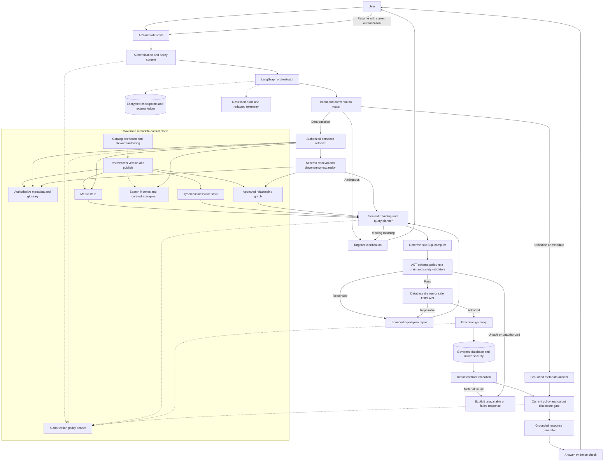
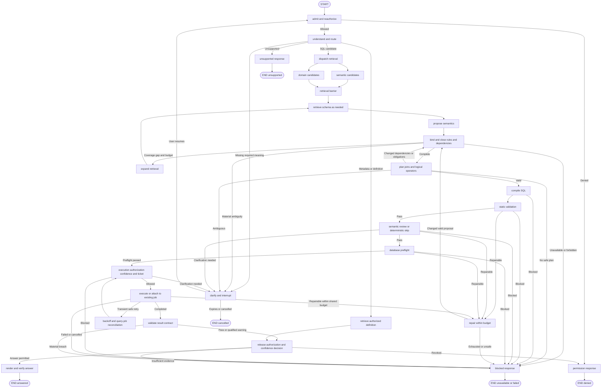
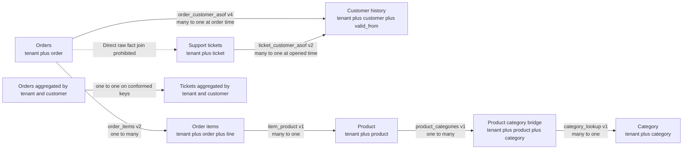

# Enterprise Text-to-SQL with LangGraph

**Reference architecture and implementation design — 11 September 2026**

**Scope.** Read-only enterprise analytics across governed data products, initially 300 tables and extensible to 5,000+. Database-neutral core with dialect-specific execution adapters. The examples are a fictional enterprise catalog; they are not claims about your data. Numerical budgets and acceptance targets below are proposed starting points, not measured guarantees.

**Document validation.** All 43 requested sections are present. The five JSON examples parse, and the Python pseudocode passes syntax checks. Three query examples were checked on synthetic SQLite fixtures, with an equivalent UTC month expression for the PostgreSQL time-series example; additional fixtures checked SCD overlap detection and an empty cohort. These checks support the illustrative relational logic, not production PostgreSQL, RLS or adapter certification.

**AWS implementation update — 12 September 2026.** The [OpenSearch implementation guide](/Users/omprajapati/Documents/Codex/2026-09-11/you-are-a-principal-ai-architect/outputs/opensearch-enterprise-rag-guide.md) expands this architecture with an introduction, indexing/search examples, object-aware chunking, dataset formats and retrieval evaluation. Its configurations are starting recommendations requiring validation in the selected AWS deployment.

## 1. Executive Summary

Build a **governed semantic query compiler orchestrated by LangGraph**. The LLM interprets language and proposes a typed semantic request. Authoritative services resolve names, metrics, rules, relationships and permissions. Deterministic planning and compilation produce SQL. Independent checks, database enforcement and result contracts control execution and release.

The main path is:

**Question → authorized intent → retrieved semantic candidates → bound semantic plan → validated logical plan → compiled SQL → admission checks → database → checked result → grounded answer.**

This is a constrained workflow with bounded model decisions, not a general agent with unrestricted database tools. A semantic metric often determines its source tables directly; searching all tables is unnecessary. Raw-data questions use hierarchical schema retrieval. Both paths converge on the same planner and enforcement layer.

Five foundational decisions:

1. **Use an intermediate representation (IR).** The LLM cannot supply executable identifiers, SQL fragments, join predicates or metric formulas. It selects authorized IDs and supported semantic operators. Every reference is bound again by code.
2. **Treat metadata as a governed software supply chain.** Extract physical facts, curate business meaning, test relationships, approve definitions, version bundles and publish immutable snapshots. A vector index is a search aid, never the source of truth.
3. **Separate correctness contracts from confidence.** Missing permission, unknown schema objects, unresolved mandatory rules and unsafe joins always block. A high confidence score cannot override them.
4. **Prefer the smallest semantically sufficient plan.** Minimize tables and joins only after proving metric, grain, rule, security and temporal requirements. A bridge or security dependency may be necessary even when the user never mentions it.
5. **Measure correctness among answered questions and coverage together.** Abstention is a product feature. A system that answers almost nothing can look accurate without being useful.

Two assumptions need correction. First, no architecture can honestly guarantee zero end-to-end semantic errors for arbitrary natural language and imperfect enterprise data. It can enforce **zero unresolved executable references and zero unapproved executable definitions within a supported query language**, subject to correct metadata, compiler, validators and database controls. Second, security must be a non-negotiable admission condition alongside correctness, not a weighted priority that correctness can outweigh.

## 2. Core Architectural Principles

| Principle | Enforced consequence |
|---|---|
| Closed-world executable vocabulary | Only catalog IDs, approved operator signatures and versioned definitions can enter a bound plan. |
| LLM proposes; platform verifies | Structured output helps parsing, but never establishes truth or authorization. |
| Fail closed | Unknown mandatory metadata, stale security state or unsupported semantics leads to clarification, refusal or an explicit unavailable response. |
| Meaning before physical layout | Resolve metric, entity role, time semantics and output grain before selecting joins. |
| Security throughout | Filter discovery, bind every dependency, enforce in the database and authorize release. |
| Explicit lineage | Each projected value, filter, join, metric and transformation has a machine-readable origin. |
| Version consistency | Pin a coherent metadata/metric/rule snapshot; recheck current security and schema compatibility before execution. |
| Bounded autonomy | Limit expansion, repair, diagnostic queries, elapsed time and database spend. |
| Restricted analytical language | Unsupported operations are added through reviewed compiler extensions, not improvised SQL. |
| Reproducibility with qualifications | Record definitions, parameters, time interpretation and data watermark; exact replay also needs an available data snapshot. |
| No silent semantic substitution | Never swap metrics, weaken filters, truncate the analytical population or approximate results without an authorized definition or explicit agreement. |
| Explanation from evidence | Explain definitions and decisions from structured provenance, not private chain-of-thought. |

## 3. High-Level Architecture

Separate a **control plane** for metadata publication from the **request plane** that interprets and executes questions. Start with these as modules in a small number of deployable services; split them when isolation, ownership or load requires it.



The execution gateway is the only request-plane component with query credentials. The model receives neither credentials nor a generic SQL execution tool. Network restrictions prevent model tools from reaching database, file-export or external-function paths directly.

## 4. End-to-End Request Lifecycle

1. Authenticate the caller, authorize the conversation, derive tenant/purpose/roles server-side, and allocate request budgets.
2. Reauthorize any referenced previous plan or result. Resolve deterministic context such as an explicit date, locale and saved report ID.
3. Interpret the question into a structured intent sketch: action, concepts, dimensions, comparisons, time requirements, entity mentions and unresolved slots.
4. Route to data query, metadata, metric definition, clarification, permission response or unsupported request. Conversational follow-up is a modifier that may lead to any route.
5. Retrieve authorized business terms, metric candidates and domain candidates in parallel. Exact governed metric matches can bypass broad schema discovery.
6. Retrieve candidate tables and columns only where dependencies remain unresolved. Expand required metric, relationship, rule and security dependencies deterministically.
7. Produce a semantic plan with evidence for every mapping. Resolve applicable rules and plan structure to a fixed point. Detect missing data and materially different interpretations.
8. Clarify only unresolved choices that affect results. Resume through fresh authentication and dependency authorization, never directly into execution.
9. Build a logical plan, prove grain and join requirements, and compile using a certified dialect adapter.
10. Parse and independently bind emitted SQL; check policy, lineage, rule placement, metric semantics and query budgets. Run safe database preparation/EXPLAIN where supported.
11. Bind a short-lived admission ticket to SQL, parameters, policy, snapshot and limits. Execute under constrained database identity with an idempotency ledger.
12. Validate completeness, shape and applicable data assertions. Apply output disclosure controls and reauthorize access before release.
13. Render a deterministic result envelope and optional grounded narrative; check every numerical claim against evidence. Return interpretation, definition versions, scope, freshness, limitations and a trace reference.

## 5. LangGraph Node Architecture

**Modes:** D = deterministic code; R = retrieval; DB = database; P = policy/rule evaluation; L = optional or required language model. Each node has a strict input/output contract. Shared infrastructure adds deadline, cancellation, audit, policy and snapshot checks.

| Component / nodes | Inputs → outputs; responsibility and data access | Mode, checks and failure behavior | Cache and scale |
|---|---|---|---|
| `admit` | Request + server session → request envelope, policy handle, budgets; identity/PDP access | D/P; verify caller, tenant, purpose and conversation ownership; deny on failure | Short-lived policy cache with revocation; stateless replicas |
| `understand` | Authorized conversation + question → intent sketch and route candidates | D + L; schema-validate output; missing meaning becomes unresolved slots; no schema invention accepted | Scoped normalized-intent cache; small capable model for routine questions |
| `retrieve_semantics` | Concepts and intent → glossary/metric/dimension matches with evidence | R; only published, authorized records; exact match before semantic search; insufficient coverage triggers expansion | Snapshot-keyed indexes; partition by security/domain |
| `retrieve_domains` | Intent → ranked authorized domains and cross-domain hypotheses | R + optional L for difficult cases; routing is advisory, never a hard exclusion | Domain summaries and supervised router; independent of catalog size per request |
| `retrieve_schema` | Uncovered concepts + domains → candidate table/column IDs | R; exact terms, lexical/vector retrieval, types, grain; no result means unavailable/expand | Cached authorized candidates; rerank bounded sets |
| `propose_semantics` | Compact verified candidates → semantic plan proposal | L for complex language; references and operators remain untrusted; reject invalid structure | Cache only with full dependency versions; stronger reasoning capability here |
| `bind_and_close` | Proposal + authoritative records → bound plan, rule closure, provenance or ambiguity | D/R/P; resolve all IDs and versions, units, types, rule applicability and permissions; block gaps | Object/dependency cache; incrementally materialized closures |
| `plan_joins` | Required entities, grains, roles and rules → approved logical plan | D; approved edges, cardinality/temporal proofs; ambiguous path means clarification | Versioned graph neighborhoods; bounded path search |
| `compile_sql` | Validated logical plan + dialect → SQL AST, SQL, parameters, lineage | D; allowlisted operators and functions only; unsupported operator blocks | Plan/dialect/compiler keyed compilation cache |
| `validate_static` | SQL + bound plan + obligations → validation report | D/P; independent binding, complete AST checks, grain and policy proof; fail closed | Reuse structural checks under identical versions; never bypass current auth |
| `semantic_review` | Original intent + plan + authoritative evidence → discrepancy codes | Optional L; catches meaning mismatches; cannot waive hard checks; unresolved material disagreement blocks | Risk-based invocation; separate prompt/model strategy only if evaluated |
| `db_preflight` | Validated query + identity + budgets → engine binding, cost/risk evidence | DB/D; safe EXPLAIN or dry run; uncertain cost may require bounded asynchronous execution or refusal | Short-lived estimates by data statistics version |
| `repair` | Typed error + verified context → constrained plan change or stop | D first, optional L; preserve intent/policy/definitions; retries bounded | No caching of unverified repairs; reuse successful compiler fixes after release |
| `execute` | Admission ticket + SQL/parameters → query-job/result handle | DB/D/P; current permission, signature/hash, timeout and scan limits; fail or cancel safely | Idempotency ledger, workload queues, per-tenant concurrency |
| `validate_result` | Result handle + expected contract → passed checks, warnings, completeness | D/DB; restricted diagnostic reads if authorized and budgeted; material breach blocks answer | Query-specific checks; offline quality profiles for expensive invariants |
| `clarify` | Missing slots + safe choices → interrupt payload, then user answer | D template, optional L wording; no restricted options; reauthorize on resume | Checkpoint reference only; do not hold DB connections |
| `release_and_render` | Safe result/definition + evidence → authorized answer envelope | D/P + optional L narrative; check output scope and claims; template fallback | Result/answer reuse only under exact scope and fresh policy |
| Metadata publisher | Physical catalogs + steward changes → immutable coherent bundle | D + human governance; referential integrity, cycle, enum, rule and join tests; quarantine invalid records | Incremental ingestion; batch embeddings; independent control-plane capacity |

All optional LLM uses and the reason for each are specified in §16. There is no LLM in authentication, rule precedence, SQL compilation, object existence checks or execution admission.

## 6. LangGraph State Definition

Use typed state with four conceptual parts:

* **Immutable request envelope:** request/turn/thread IDs, start time, locale, request reference, caller context reference and budget policy. Server code owns these fields.
* **Pinned evidence bundle:** catalog snapshot, semantic bundle, rule versions, dialect capability version, retrieved object IDs, hashes and freshness. Search scores stay separate from authoritative truth.
* **Working interpretation:** intent sketch, candidates, unresolved slots, expected-answer contract, semantic plan, logical plan, SQL artifact reference and machine-readable decisions.
* **Execution evidence:** validation reports, repair counters, query-job ID, result reference, completeness, confidence components and safe public response.

Store **references to large or sensitive artifacts**, not raw result sets, credentials, full prompts or all schema text. A reference is not a bypass: dereference requires authorization. Parameter values may be sensitive and belong in a protected artifact store. Never persist live database sessions or transaction objects.

Use explicit fields for `schema_snapshot_id`, `policy_epoch`, `metric_versions`, `rule_bundle_version`, `compiler_version`, `retrieval_rounds`, `repair_attempts`, `db_retry_attempts`, `diagnostic_queries`, `deadline`, `decision` and `reason_codes`. Preserve the original request separately from normalization so semantic review can detect meaning lost during rewriting.

Parallel branches write distinct keys such as `domain_candidates` and `semantic_candidates`. If results must merge, use a deterministic keyed reducer with duplicate detection and bounded size. Do not let parallel nodes overwrite a shared list or mutate security context. Runtime validation with typed models is still required; Python type hints alone do not enforce state integrity.

## 7. Routing and Conditional Edge Logic



Routing returns enumerated outcomes, not free-text instructions. A denial is deterministic; low retrieval recall is not proof of denial. Permission responses reveal object existence only if discovery policy permits it; otherwise use a uniform unavailable/access-limited response.

Default budgets: two retrieval expansions after the initial pass, two plan-repair attempts total across static/preflight failures, and two transient retry attempts after an initial infrastructure attempt. Apply a total wall-clock/compute budget as well. Clarification is user-driven and need not have an arbitrary two-turn cutoff, but waiting requests expire and can be cancelled. Never reduce security checks to meet a deadline.

The same two-repair budget also covers semantic-review and classified execution failures. Clarification expiry/cancellation is managed by the API/control plane: an interrupt does not wake itself when time passes. Mark the request terminal in the request ledger and reject later resumes before graph invocation.

Current LangGraph supports state graphs, conditional routing, persistence and interrupts. Resume restarts the interrupted node; therefore keep that node free of non-idempotent side effects and route resumed work through authorization. Use a true fan-in barrier for parallel retrieval. Private state schemas are not a public-stream redaction mechanism. [LangGraph graph API](https://docs.langchain.com/oss/python/langgraph/graph-api), [interrupts](https://docs.langchain.com/oss/python/langgraph/interrupts), [durable execution](https://docs.langchain.com/oss/python/langgraph/durable-execution).

## 8. Enterprise Metadata Architecture

Maintain three distinct layers:

1. **Physical catalog:** connector-observed databases, schemas, tables, views, columns, types, constraints and engine capabilities. Record whether each constraint is enforced, declared only, profiled or unknown.
2. **Governed semantic catalog:** business concepts, entities, dimensions, metrics, rule definitions, approved relationships, analytical operations and data-product contracts.
3. **Derived retrieval projections:** authorized search documents, embeddings, inverted indexes, synonyms and graph neighborhoods. These can be rebuilt from published authoritative records.

For every table store database/connection ID, namespace, exact quoted identifier, stable object ID, object type, description, business description, purpose, domain memberships, owner/steward, table grain, candidate keys, PK/FK declarations, columns, synonyms, glossary mappings, associated metrics, applicable rules, classification, policy resource ID, freshness and quality information, approved/prohibited joins and preferred paths.

Additional metadata is essential:

| Area | Required fields and purpose |
|---|---|
| Identity and lifecycle | Stable UUID, source object ID, valid/system times, checksum, publication state, replacement ID, schema fingerprint; distinguish rename from drop/recreate. |
| Grain and keys | Grain expression, uniqueness scope including tenant, key nullability, enforcement evidence, effective dates, test status; control multiplicity. |
| Column semantics | Physical/logical type, unit, currency, scale, timezone, collation, null meaning, aggregation behavior, allowed operations, source lineage and security actions. |
| Temporal semantics | Event/processing/ingestion time roles, date vs instant, fiscal calendar ID, SCD validity, late-arrival policy, snapshot/as-of availability. |
| Value knowledge | Authoritative enum or code-list reference, canonical ID, aliases, evidence completeness, last refresh, discovery policy; separate constraints from illustrative samples. |
| Relationship semantics | Role names, predicate AST, composite keys, cardinality in each direction, optionality, temporal predicates, allocation, referential coverage and allowed join types. |
| Analytical compatibility | Allowed metric/dimension combinations, additivity, filter placement, population definition and cross-domain conformance mappings. |
| Source operations | Connector/dialect version, function signatures and volatility, partition keys, statistics, cost capabilities, read-only/preflight support and data-residency boundary. |
| Quality | Contract version, freshness watermark, coverage interval, missing partitions, uniqueness/reconciliation assertions and severity. |
| Authority | Origin URI, extraction time, steward approval, owner, evidence type, trust status and provenance chain. |

Descriptions can aid retrieval but cannot create executable facts. An extracted FK may prove key connectivity while still being unsuitable for a business question. A profiled relationship becomes available for governed execution only after the required approval and contract tests. Do not discover arbitrary joins at request time from similarly named columns.

Publish metadata bundles atomically after reference checks and semantic tests. Maintain bitemporal fields where historical business validity differs from when the organization learned or corrected a definition. Changes invalidate affected cached plans and examples through dependency lineage.

## 9. Semantic Layer / Metric Store Design

Represent a metric as a **versioned typed expression DAG**, with a public business contract and separately protected physical implementation.

The contract includes canonical ID and namespace, display name/aliases, owner, description, population, unit/currency, valid time, supported dimensions, default/allowed time roles, time grains, null/zero semantics, additivity, completeness/freshness requirements, version policy, permissions and deprecation/replacement information. The implementation contains bound measures, filter predicates, operator nodes and dependency IDs.

* **Base metric:** approved aggregate over a defined population at a known grain.
* **Derived metric:** typed expression over pinned base metrics; e.g., average order value = revenue / completed-order count with explicit zero-denominator behavior.
* **Nested metric:** recursively expanded dependency DAG; detect cycles at publication and binding. Nested aggregate operations require explicit grain transitions rather than illegal nested SQL aggregates.
* **Ratio:** aggregate numerator and denominator at compatible output grains before division; never average percentages unless the definition says so.
* **Semi-additive measure:** define allowed aggregation axes; account balance can sum across accounts but needs a defined snapshot rule across time.
* **Non-additive measure:** distinct users cannot be summed across overlapping segments without an approved mergeable representation and exact/approximate policy.
* **Temporal metric:** specify comparison alignment, fiscal/calendar periods, partial-period treatment, late-arriving facts and whether historical values are restated.

Bind dependencies to exact versions. A request for an official current report usually applies the selected definition consistently across its full period. A historical/as-published request may require the definition effective at each historical date. Do not switch definitions row-by-row merely because a query spans a version boundary: that policy itself must be explicit. Period comparisons need a consistent definition or an explicit disclosed restatement strategy.

Use namespaces such as `finance.revenue`, `commerce.gross_sales` and `sales_pipeline.revenue_forecast`. Resolve aliases within governed domain/context defaults; name collisions with different meaning require a choice. Deprecated definitions may be replayed only where permitted and available, with a notice; never silently replace one with a changed formula.

Retrieve the public metric contract first, then resolve its full implementation closure under execution policy. A user allowed only aggregate revenue does not automatically gain access to its raw amount column. Expose such metrics through a separately governed aggregate product or constrained execution service.

Adopt an existing semantic layer when its exact semantics fit. dbt/MetricFlow is a candidate in a dbt estate, but certify required joins, time semantics, dimensions and engines before relying on it; a platform adapter must reject unsupported cases. [dbt semantic models](https://docs.getdbt.com/docs/build/semantic-models), [MetricFlow join logic](https://docs.getdbt.com/docs/build/join-logic).

## 10. Rules Engine Design

Do not implement `Global → Domain → Table → Column → Metric → Join → User` as an unconditional override chain. Scope and precedence are different concepts: a user preference must never override tenant isolation, and a table default must not redefine a certified metric.

Model each rule with `id`, `version`, `authority`, `kind`, `scope`, `activation_predicate`, `effect`, `priority_within_class`, `overrideable`, `overrides`, `validity`, `dependencies`, `owner`, `tests` and `failure_severity`.

| Rule class | Resolution semantics |
|---|---|
| Security prohibitions and mandatory obligations | Deny wins; obligations accumulate; lower classes cannot override. |
| Certified metric/business invariants | Apply whenever their governed concept is used; conflicts block unless an approved explicit variant exists. |
| Domain/table/column/join contextual rules | Compose all applicable compatible predicates and structural effects; explicit approved precedence resolves only intended alternatives. |
| Defaults | Apply only to unfilled semantic slots, such as approved default timezone or status population. |
| Preferences | Optimize among already valid plans: preferred source, join path or time grain. |

Use a restricted rule language over typed plan properties, object IDs, metric dependencies, semantic roles and trusted context. Effects include mandatory filters, semi-joins, temporal conditions, forbidden combinations, required grouping, minimum cohort size, unit conversion, masking obligations, preferred paths and required disclosure text. Specify operator placement: a row filter before aggregation is not equivalent to `HAVING`, and a predicate in a `WHERE` clause can accidentally turn a left join into an inner join.

**Dependency closure algorithm:**

1. Seed objects from the bound question and chosen metric versions.
2. Retrieve all rules whose indexed activation predicates may match that set, including global and domain rules.
3. Evaluate applicability deterministically against the semantic plan and trusted context.
4. Add required dependencies and obligations; reauthorize every addition.
5. Recompute candidate relationships and evaluate rules activated by table combinations or join roles.
6. Re-evaluate after concrete join/operator selection until objects, rules, selected relationships/roles, operators and obligations stop changing; canonicalize duplicate effects.
7. Resolve allowed defaults/preferences, detect contradictions and produce an obligation proof map.

The dependency-addition phase should be monotone over a finite published catalog. Reject cyclic rewrites and unresolved precedence at publication; cap runtime closure, for example at eight rounds, and fail explicitly if it does not converge. Do not interpret a non-convergence error as permission to ignore a rule.

Maintain a common base closure and a separate closure for each candidate logical plan. Rules activated only by a discarded join path must not remain attached to the winning plan. The join planner returns to binding whenever its selected operators introduce dependencies or change rule applicability; compilation starts only after this joint fixed point is stable.

Compile executable rule effects into logical operators. Include concise rule explanations in model context so interpretation and user-facing explanations are coherent, but prompt injection of rule prose is never enforcement. Unstructured policy documents require steward translation and approval before they become executable rules.

## 11. Schema Retrieval Architecture

Use two entry paths: **metric-first dependency resolution** for named metrics and **concept-first hierarchical retrieval** for exploratory questions. Both share authorized IDs and completeness checks.

For the AWS implementation, use OpenSearch as a searchable projection of the governed catalog, with keyword/vector retrieval behind a trusted authorization service. Retrieve candidate IDs, recheck current permissions and versions, then resolve full authoritative definitions and mandatory dependencies. OpenSearch relevance scores do not authorize data or establish join correctness.

Chunk metadata by object: keep a metric, rule or relationship discovery card intact, and resolve its executable definition through the registry. For longer explanatory prose, 512 tokens with approximately 64 tokens of within-section overlap is an initial experiment, not a proven optimum. Compare alternatives on object recall, complete dependency coverage, context cost and downstream answer accuracy. Detailed mappings, query examples and dataset structures are in the [OpenSearch implementation guide](/Users/omprajapati/Documents/Codex/2026-09-11/you-are-a-principal-ai-architect/outputs/opensearch-enterprise-rag-guide.md).

| Stage | Method | Starting budget, to be tuned on recall |
|---|---|---|
| Domain | Exact glossary mapping, lexical/vector domain summaries, conversation evidence | Retrieve 3–5 candidates; normally carry 1–3, retaining alternatives when ambiguous. |
| Semantic objects | Canonical/alias match, metric and entity indexes, domain filters | 5–15 relevant metric/dimension/concept candidates; resolve exact authoritative matches early. |
| Tables | Union of metric dependencies, exact entity mappings, lexical/BM25 and vector results | Retrieve 20–40 candidates; rerank to 6–12 descriptive cards for planning. |
| Columns | Per-table lexical/vector/type search plus semantic binding | Roughly 5–15 candidate columns per selected table; normally 30–80 model-visible columns total. |
| Relationships | Approved graph traversal and mandatory dependency closure | Normally 2–8 execution tables; no arbitrary correctness cutoff at eight. |
| Final context | Bound metric/rule contracts, chosen objects, alternatives and expected answer shape | Usually 4k–12k tokens, with explicit staged retrieval for larger questions. |

These are model context budgets, not permission to drop required fields. Keys, policy fields, rule columns, temporal predicates, metric components and bridge tables enter the compiler context even if they did not score highly in similarity search. Security-only internals need not enter the LLM context.

Use reciprocal-rank fusion or a trained ranker to combine lexical and vector candidates without pretending their raw scores have identical meaning. Exact business IDs, acronym dictionaries, synonyms, type compatibility, grain compatibility and authoritative metric mappings usually matter more than generic similarity. A compact cross-encoder reranker is useful when measured recall/latency improves; it cannot certify truth.

Search descriptions and safe business concept documents; column embeddings are selective, not mandatory for every technical ID column. Embeddings for sensitive values require the same classification and residency controls as the source. Safe authoritative code lists are preferable to bulk sampled data. Preserve user-supplied literals as typed parameters; unknown enum aliases need resolution. A user can intentionally search for a nonexistent free-text value and receive no matches—do not fabricate a replacement or claim sample absence proves nonexistence.

**Preventing retrieval misses:** maintain a requirement coverage matrix mapping every requested metric, dimension, filter, entity role and time concept to a bound object or unresolved slot. Validate graph connectivity and compatible grains. Expand around anchored entities, try alternate authorized domains, increase retrieval depth and fall back to exact structured catalog search. Mandatory metric/rule dependencies bypass top-K pruning. If coverage remains incomplete, stop; no retrieval method can guarantee a missing table will always be found from arbitrary wording.

Query history and curated examples can boost candidate ranking only after authorization and version checks. Never copy historical predicates because they happened to appear in a similar question.

Authorization filtering must operate inside the trusted search boundary before payloads reach rerankers or LLMs. Avoid returning unauthorized IDs, counts, snippets or cached examples. For approximate vector search, test filtered recall specifically; pgvector documents recall loss under filters and iterative-scan/partitioning options. [pgvector filtering and multitenancy](https://github.com/pgvector/pgvector).

## 12. Join Graph Architecture

Use a directed, typed multigraph. Nodes are physical relations or governed relation instances; multiple edges between the same pair represent different business roles. A role-playing date dimension can therefore represent order date and shipment date without conflating them.

Each relationship stores approved predicate AST, tenant/composite keys, direction, join types, cardinality bounds, key evidence, referential coverage, optionality, SCD validity, role labels, allowed metric/dimension combinations, prohibited usages, preferred contexts, allocation semantics, confidence evidence, owner and validity dates.

An edge labeled “foreign key exists” is evidence, not sufficient proof that it answers “customer region at purchase time.” The relevant edge must encode that temporal/business role. Warehouses with informational constraints need separate contract evidence.

**Planning algorithm:**

1. Derive required semantic terminals from metrics, dimensions, filters and mandatory obligations.
2. Filter the graph by permission, snapshot, business role and prohibited combinations.
3. Enumerate a bounded set of candidate connection subgraphs using approved path templates and constrained shortest-path/Steiner-tree heuristics. Multi-terminal planning is not just repeated shortest paths.
4. Prove operator grain and cardinality behavior; insert semi-joins, preaggregation or approved allocations where needed.
5. Reject semantically invalid or unproven candidates.
6. Rank survivors lexicographically: required semantics and hard constraints; preferred approved business path; aggregation safety; fresh relationship evidence; then hops, estimated cost and historical success.
7. Remove redundant tables only with a proof that result population, multiplicity, security obligations and null preservation remain equivalent.

A cost function may combine hops, scan cost, duplication risk and uncertainty **within the valid candidate set**. Do not allow enough historical popularity or low cost to compensate for a prohibited edge. Search budgets should start with two-to-four-hop neighborhoods and expand for certified longer paths; no universal hop threshold guarantees correctness.

| Join situation | Required treatment |
|---|---|
| Fact → unique dimension | Verify uniqueness at the joined key and intended time; preserve or exclude unmatched facts according to contract. |
| Composite keys | Bind the complete key, including tenant; partial matches fail validation. |
| Multi-hop | Each edge and the composed grain transformation must be approved; validate loss as well as multiplication. |
| Bridge / many-to-many | Use semi-join for existence filtering; for grouped attribution require explicit membership or allocation semantics. |
| Fact → fact | Aggregate each fact independently to compatible conformed dimensions before joining; align populations/time windows and check resulting key uniqueness. |
| SCD / temporal | Use approved half-open validity intervals, non-overlap guarantees and fact event time or an explicit snapshot rule. |
| Multiple valid paths | Resolve entity roles and business semantics; clarify if alternatives change answers. |
| Prohibited or disconnected path | Stop or select a separately approved data product; do not invent a cross join. |

Track functional dependencies and multiplicity per logical operator. Summing an order-header amount after joining order lines is unsafe because one order can appear several times. `SUM(DISTINCT amount)` is not a repair: different orders can have equal amounts. `COUNT(DISTINCT key)` is valid only for an explicitly defined entity-count metric. Preaggregation is safe only when performed at sufficient grain and with compatible filter semantics.

Minimum tables is therefore a **constrained minimization problem**, not the first objective. A mandatory internal-customer exclusion or SCD attribution may require an additional relation; a governed denormalized product can replace it only with certified equivalent semantics and current security.

## 13. Semantic Query Plan / Intermediate Representation

Use three related representations:

1. **Intent sketch:** unresolved language-level concepts and requested answer shape, retaining evidence spans and ambiguities.
2. **Bound semantic query plan:** typed, authorized metric/dimension/entity/filter IDs, explicit time/comparison/cohort semantics and pinned versions. This is the durable interpretation contract.
3. **Logical relational plan:** scans, mandatory policies, filters, temporal joins, semi-joins, aggregation, windows, set operations, sorting and limits, all with schemas and grain annotations. This is compiler input.

The semantic IR should support:

* `action`: lookup, aggregate, trend, compare, rank, cohort, funnel, retention, definition or metadata.
* `metrics`, `dimensions`, `entity_filters`, `population` and `result_grain`.
* Typed filter AST: `and/or/not`, comparison, membership, existence and approved semantic predicates. Distinguish row filters, metric-local filters, post-aggregate filters and window filters.
* `time`: field role, interval, timezone, calendar, grain, completeness and definition-as-of policy.
* `comparison`: baseline, alignment, absolute/relative change and denominator-zero handling.
* `cohort`: entry event, entity, eligibility, cohort date, observation window and censoring.
* `funnel`: ordered events, identity stitching rule, event windows, repeated-event handling and denominator.
* `ranking`: partition, metric, direction, N and tie policy.
* `exactness`: exact or an explicitly approved approximate definition.
* `binding`: immutable definition versions, catalog snapshot and semantic lineage.
* `obligations`, `expected_result_contract`, `unresolved_slots`, and evidence references.

Use opaque catalog IDs rather than model-written SQL names. The LLM can propose only operators in the schema; it cannot insert strings that the compiler treats as expressions. Constants are typed and parameterized. Derived output aliases are generated by code and recorded in lineage; they are not required to exist as physical columns.

Formal admission invariants include:

```text
all physical references ⊆ verified, authorized catalog dependencies
all metric definitions = published, permitted, pinned versions
all join predicates = approved relationship predicates plus approved obligations
all executable operators ∈ certified dialect capability set
all mandatory obligations have valid placement and lineage evidence
output grain and population satisfy the expected-answer contract
unresolved material slots = empty
```

An IR intentionally limits initial expressiveness. Supporting arbitrary SQL through an escape hatch would remove its strongest guarantees. Introduce new analytical operators through reviewed semantics, dialect implementations, security checks and adversarial fixtures.

## 14. SQL Generation Strategy

**Recommendation: the production SQL generator is deterministic.** The model generates a semantic proposal; the binder and planner create the SQL-generating logical plan. SQL rendering uses dialect adapters and bound object/function registries.

The semantic-planning model receives only:

* Original question plus normalized intent and explicitly resolved conversational references.
* Authorized candidate IDs, concise business descriptions, types, units, grains and semantic roles.
* Relevant public metric contracts and exact version IDs; no authority to rewrite formulas.
* Candidate approved relationships and business meanings, with only model-visible implementation details.
* Applicable business constraints, missing slots and safe clarification options.
* Supported analytical operators and relevant certified examples, with literals abstracted where possible.
* Desired result contract: population, metrics, dimensions, time, units, ranking and completeness.

The compiler additionally receives complete verified physical dependency closure, rule operators, approved predicate ASTs, dialect/function capability manifests and trusted policy bindings. It never receives untrusted prose as executable code.

For every logical operator, specify input/output schema, grain, nullability and lineage. Generate explicit projections; fully qualify relations; generate aliases; bind data values as parameters; disallow unbound identifier placeholders. Do not allow `SELECT *` or arbitrary function names through the IR.

For highly unusual SQL, offer an analyst engineering workflow that produces a new reviewed operator or approved query template. Direct model-written SQL may be useful in an isolated development sandbox to expand compiler coverage; it should not become an automatic production fallback. Automatic transpilation is not sufficient dialect certification. SQLGlot supports parsing/transpilation and optional type-aware optimizer rules, but schema qualification is not automatic in every path and unsupported translations should raise errors. [SQLGlot documentation](https://sqlglot.com/sqlglot.html).

## 15. Deterministic Validation Layer

Validation operates on both the bound logical plan and the independently parsed emitted SQL. Comparing only SQL strings is insufficient. Preserve a semantic/lineage fingerprint and verify that emitted operations satisfy the original obligations; use a separate validator implementation where practical to reduce common compiler defects.

| Layer | Deterministic check | Failure action |
|---|---|---|
| 1. Syntax | Parse the exact target dialect; require one permitted statement. | Compiler/adapter failure; no execution. |
| 2. Complete AST | Traverse every subtree including CTEs, subqueries, functions, windows, unions and table-valued calls; reject unsupported nodes. | Block; no “unknown means safe.” |
| 3. Tables | Bind every base relation/view to the pinned catalog and allowed surface; expand or attest view lineage. | Refresh incompatible metadata once or stop. |
| 4. Columns | Resolve scopes/aliases/CTEs and types; reject ambiguous or unknown references in any clause. | Repair only through verified binding. |
| 5. Joins | Match predicates, roles, join types and key completeness to approved relationships; no undeclared Cartesian products. | Block or use a valid planned alternative. |
| 6. Authorization | Check read/filter/group/join/order/window/infer/execute-metric actions for every dependency and output. | Deny; never repair by changing privilege. |
| 7. Metrics | Confirm pinned formula DAG, population, units, denominator and supported dimensions. | Block altered or incomplete formula. |
| 8. Rules | Every mandatory obligation has evidence at the correct operator location; no contradiction. | Block missing or incorrectly placed rule. |
| 9. Aggregation | Propagate grain, multiplicity and additivity; distinguish aggregate-of-ratio from ratio-of-aggregates. | Block unsafe aggregation. |
| 10. GROUP BY | Check selected fields, functional dependencies, aggregate/window phase and final grain. | Recompile a valid logical plan. |
| 11. Time | Resolve half-open ranges, time roles, timezone, calendar, period alignment, coverage and partial-period policy. | Clarify or report incomplete data. |
| 12. Dialect | Validate operator/function signatures, casts, decimal division, null ordering, collation and supported features. | Reject unsupported lowering. |
| 13. Safety | Read-only allowlist, no DDL/DML, writes in CTEs, exports, network functions, unsafe UDFs, recursive runaway or unauthorized catalogs. | Reject immediately. |
| 14. Cost | Bound scans, output bytes, estimated cardinality, execution time, concurrent load and per-tenant budget. | Queue, require narrower scope, or refuse. |
| 15. Semantic consistency | Compare all formalized intent slots and expected output shape to plan/SQL lineage. | Block mismatch; language-level issues go to §16. |
| 16. Fan-out and loss | Key/FD proofs, join multiplicity bounds, SCD uniqueness, unmatched-row policy, allocation and row-loss checks. | Block unproven metric correctness. |

A successful parse proves only grammar acceptance. Database preparation proves engine acceptance, not business meaning. An EXPLAIN estimate is evidence about physical execution, not a certificate that joins are semantically correct. Full SQL equivalence is not generally tractable; obtain stronger guarantees by restricting the IR and certifying compiler transformations against fixtures.

Business invariants with no enforced physical proof require explicit quality evidence. For mission-critical aggregates, stale or failed uniqueness/SCD tests can quarantine the affected metric or relationship rather than becoming a low-weight confidence penalty.

## 16. LLM-Based Validation Layer

Use models at meaning boundaries, and only when a deterministic alternative cannot reliably cover the language variation.

| Model use | Capability and why it needs an LLM instead of deterministic code | Allowed output and authority limit |
|---|---|---|
| Intent, normalization, follow-up interpretation | Strong instruction following and structured extraction; paraphrases, implicit comparison and conversational reference exceed practical keyword coverage. Deterministic parsers still handle dates/IDs where unambiguous. | Intent sketch, evidence spans, alternative meanings; cannot set trusted identity or invent authoritative entities. |
| Difficult concept/domain disambiguation | Semantic matching across business wording; exact dictionaries remain the first path. | Ranked known IDs with explanation; retrieval/binder verifies IDs. |
| Complex semantic plan proposal | Reasoning across requested populations, cohorts, ranking and temporal comparisons; code cannot enumerate every language formulation. | Typed supported operators over authorized candidates; no raw SQL. |
| Optional semantic critic | Compare original wording with the formal plan and detect omissions that formal constraints could not capture, such as “customers who bought” versus “purchases of.” | Structured discrepancy codes and cited question spans; cannot certify security, waive rules or approve unknown metadata. |
| Constrained semantic repair | A database/type error may expose an interpretation problem requiring a revised semantic operator; mechanical fixes stay deterministic. | Small typed plan diff; immutable constraints and definitions cannot change. |
| Optional clarification wording | Useful for readable phrasing in varied language; finite slot questions should use templates. | One targeted question based on approved alternatives; cannot introduce hidden resource names. |
| Optional narrative | Summarizes a validated result for varied user requests; templates handle values, units and standard comparisons. | Claims with result/definition evidence IDs; unsupported claims are rejected or replaced by a template. |

A cross-encoder or embedding model ranks relevance; it is not a reasoning agent or correctness authority. A learned intent classifier can replace an LLM for well-covered routes if evaluation supports that choice.

The critic is useful for complex, high-risk plans and disagreement cases, not mandatory for “count active contracts in June” when all slots bind unambiguously. Multiple models can make correlated mistakes; agreement is weak evidence unless its incremental value has been measured. Never ask a critic to “verify the schema” when a catalog lookup can establish it exactly.

Use structured, capped critic output: `mismatch_type`, `question_span`, `plan_field`, `evidence_ref`, `suggested_action`. Do not store or expose private chain-of-thought. If the critic identifies a material unresolved issue, clarify or stop; it cannot manufacture a missing metric definition.

## 17. Authorization and Security Architecture

Implement identity-based and attribute-based policies with separate actions for **discover metadata**, **read data**, **use a field in a predicate/join/grouping**, **execute a metric** and **disclose an output**. Domain/table-group grants expand to effective resources; explicit denies and row/column restrictions still apply. “All tables” does not mean a database superuser.

| Boundary | Exact enforcement |
|---|---|
| API and resume | Authenticate caller, derive tenant/purpose/roles server-side; check thread ownership; disregard model/user-provided privilege claims. |
| Conversation load | Reauthorize previous plans/results and remove inaccessible material before model context assembly. |
| Domain/glossary/metric retrieval | Filter discovery permissions before summaries, examples, snippets or candidates reach models. |
| Table/column/value retrieval | Apply field and safe-value discovery policy; tenant isolation covers vector/lexical indexes and caches. |
| Graph traversal and dependency closure | Authorize every new table, column, rule dependency and relationship role; no privileged bridge traversal exposed to the model. |
| Plan/AST binding | Check every use, including hidden predicates, ordering, groupings, denominators, window partitions and subqueries. |
| Preflight/execution | Recheck current policy; execute only through a valid admission ticket and constrained identity. |
| Database | Native grants, RLS, security views/column controls and tenant isolation provide independent enforcement. |
| Output and artifacts | Reauthorize result, download, chart, SQL, explanation and lineage; enforce masking/aggregation disclosure obligations. |
| Audit and caches | Separate administrative visibility from end-user permissions; authorize every retrieval and cache hit. |

**Database identity.** Prefer identity passthrough where supported. Otherwise, a dedicated trusted execution service maps authenticated users to constrained database roles or trusted session context. The caller and model cannot set that context. Connection pools must set and verify context transaction-locally and clear it before reuse. Parameterizing `tenant_id` helps, but an application-added filter alone is not the security boundary.

In PostgreSQL, superusers and `BYPASSRLS` roles bypass RLS, and table owners normally do too; use a constrained non-owner execution role and test the actual permissive/restrictive policy composition. Treat security-definer functions and view ownership semantics as explicit review items. [PostgreSQL row security](https://www.postgresql.org/docs/current/ddl-rowsecurity.html).

**Aggregate-only access.** If a user may see Revenue but may not read underlying order amounts, expose Revenue as a sealed metric product with its own execution permission, approved dimensions and row scope. The model sees its public contract. A protected service binds physical dependencies internally. A missing raw-table grant must never be silently bypassed with broad service credentials.

**Inference and PII.** Masking a projected value does not prevent inference through filtering or sorting. Authorize operations. For sensitive aggregates, apply the domain's release policy: minimum populations, complementary suppression, dimension restrictions, anti-differencing controls or a separately governed differential-privacy product. Minimum cell size alone is not sufficient protection. Do not add noise to financial figures without an explicit metric/product contract.

**Prompt injection.** Treat descriptions, historical questions, retrieved documents, error messages and result cells as data. They cannot register tools, change policy, modify the operator allowlist or become metric definitions. Separate trusted structured fields from untrusted prose; cap length; sanitize rendering; use artifact provenance and steward review to resist catalog poisoning. Model providers receive only permitted data under configured residency/retention conditions.

**Query abuse.** Enforce statement and function allowlists, no exports/network access, query time/bytes limits, concurrency, result size and rate limits. A read-only `SELECT` can still be unsafe through UDFs, expensive recursion or external calls. Result masking occurs before serialization, download, caching and narrative generation.

Policy outages fail closed for protected operations. Do not disclose whether inaccessible employees, tables or metrics exist unless discovery is authorized. Audit both blocked proposals and released outputs.

## 18. Query Execution and Repair Loop

Issue an admission ticket containing hashes of canonical SQL and parameter payload, plan revision, approved dependency manifest, effective principal/tenant/purpose, policy revision, expiry, data constraints, permitted connector and limits. Sign it or keep it in a server-controlled store. The gateway verifies it against the exact query submitted; validated SQL cannot be swapped afterward.

Execution admission also evaluates the **pre-execution confidence/coverage policy** from §20. Unresolved uncertainty requiring user meaning routes to clarification; insufficient non-resolvable evidence blocks. Passing preflight alone is not permission to execute.

Use engine-specific adapters:

* Parse/bind or dry-run under the same effective access scope as execution.
* Run only approved nonexecuting EXPLAIN modes; `EXPLAIN ANALYZE` executes work and is not a free safety check.
* Read-only transaction/query options and restricted roles.
* Server-side statement timeout, scan/bytes limits where supported, result row/byte caps, cancellation and workload isolation.
* Stable query-job ID and an external execution ledger to reconcile uncertain outcomes.

BigQuery dry runs validate queries and estimate processing; external-source estimates can be incomplete. A final `LIMIT` does not generally bound scanned data. Treat engine cost controls as adapter-specific contracts, not universal SQL behavior. [BigQuery dry runs](https://docs.cloud.google.com/bigquery/docs/running-queries), [BigQuery query cost behavior](https://cloud.google.com/bigquery/pricing).

| Error class | Permitted action |
|---|---|
| Transient network/rate-limit/service failure before submission | Retry with jitter within transport and total budgets. |
| Unknown outcome after submission | Reconcile query-job status; attach/cancel as supported. Never blindly launch a duplicate. |
| Compiler syntax/dialect defect | Deterministic adapter repair or stop; route defect to engineering. |
| Unknown object/type after catalog drift | Refresh affected authoritative metadata once; rebind and revalidate. No fuzzy substitution. |
| Repairable semantic operator mismatch | At most two total typed plan-repair attempts; all changes pass the complete pipeline again. |
| Excessive estimated cost | Use an equivalent approved aggregate/materialization or semantics-preserving rewrite; otherwise request narrower scope or offer an authorized asynchronous job. |
| Permission denial | Stop and refresh policy if stale; never retry using more privileged credentials. |
| Missing metric/rule/relationship | Clarify or unavailable; no repair can invent authority. |
| Empty or suspicious result | Preserve original semantics; apply §19 diagnostics. Do not remove filters to obtain rows. |

Repairs operate on a semantic/logical plan diff. Reject changes to requested population, metric version, time interval, tenant scope, exactness or mandatory rules unless the user or an authoritative default resolves an actual ambiguity. Sanitize database errors before model use.

Keep transport retries separate from semantic repair but charge all of them to a shared deadline and cost budget. Checkpoint durability does not guarantee exactly-once database execution. LangGraph should resume orchestration from persisted state while the gateway reconciles external jobs. [LangGraph durable execution](https://docs.langchain.com/oss/python/langgraph/durable-execution), [fault tolerance](https://docs.langchain.com/oss/python/langgraph/fault-tolerance).

## 19. Result Validation

Attach an expected-result contract to the semantic plan before SQL generation. Validate:

1. Output columns, types, units and dimension names.
2. Unique output grain, expected time buckets, ordering, tie policy and top-N behavior.
3. Completion: succeeded job, consumed result, truncation/page status, coverage and freshness.
4. Metric-specific null, empty-set, denominator-zero and range behavior.
5. Available population, key and reconciliation assertions.
6. Required disclosure controls before release.

Distinguish **hard contract violations** from **anomaly warnings**. Duplicate output keys, missing required dimensions or a failed approved uniqueness contract can block. Unusually low revenue or an empty result is an anomaly, not proof of an incorrect query.

Checks can include distinct parent-key counts before/after joins, approved reconciliation totals, SCD interval overlap tests, allocation weights, count bounds and missing partitions. Prefer ingestion-time contracts for expensive checks. Permit at most one targeted diagnostic query by default, under the same authorization and budget, where its result could change the decision.

Do not impose generic bounds incorrectly: a population proportion may require 0–100%; year-over-year growth can exceed 100%; negative revenue may be valid for an approved accounting metric. A subtotal need not equal a total for overlapping categories or distinct-count metrics. Expected invariants belong to the metric definition.

Successful execution cannot establish that the question was interpreted correctly. Sanity checks cannot prove every business result. An empty result can mean no matching authorized data, incomplete coverage or a valid filter with no matches. Give only the explanation supported by available evidence. Never claim “there are no records in the enterprise” from a restricted query.

The response generator receives a safe table/summary plus evidence IDs, never unrestricted result rows by default. Numbers, comparison arithmetic, rounding and units should be produced deterministically. Validate optional narrative claims against cells and formulas; avoid causal explanations unless separate evidence supports them.

## 20. Confidence Scoring

Use **hard gates plus a calibrated selective-answering model**, not an average of reassuring scores.

```text
eligible = current_authorization
       AND all_references_bound
       AND complete_metric_and_rule_closure
       AND approved_join_and_grain_contract
       AND supported_dialect_and_safe_query
       AND no_material_unresolved_ambiguity

p_correct = calibrated_model(observed_evidence)   # only if eligible
```

Features include intent route margin, exact versus inferred terminology matches, coverage of requested slots, retrieval alternative margins, metric uniqueness, relationship provenance and freshness, cardinality proof strength, number of repairs, formal semantic coverage, out-of-distribution indicators, execution outcome and result checks. Keep separate **pre-execution** and **post-result** estimators so execution evidence is not falsely available when deciding whether to execute.

Fit an interpretable classifier or compact model on independently adjudicated enterprise cases. Calibrate on a held-out set using an appropriate method such as isotonic or logistic calibration; evaluate on a separate test set. Do not multiply correlated component “probabilities.” Report confidence intervals, calibration reliability and risk at the selected coverage. Calibration is empirical and can degrade under distribution shift. [Guo et al., calibration research](https://proceedings.mlr.press/v70/guo17a.html).

| Level | Proposed policy |
|---|---|
| High | All gates pass and the query's evaluated domain/risk slice meets the target selective error rate. Execute/release with definitions, time and scope. A candidate threshold such as 0.99 is valid only after calibration supports it. |
| Medium | Hard gates may pass, but evidence is insufficient for automatic release. Resolve a material ambiguity, retrieve specific missing evidence or run a bounded diagnostic. If unresolved, withhold the numerical answer. |
| Low | Abstain, explain missing supported information, or return an authorized metadata answer. Do not execute speculative plans. |

Before sufficient labeled data exists, display **verified / clarification required / unavailable** evidence status instead of an invented numeric correctness probability. A passed validator should be shown as a fact, not “99% confidence.”

## 21. Clarification Strategy

Build a set of materially plausible interpretations, not merely the top retrieval hit. Compare candidate plans on metric identity, population, dimension role, time role, calendar, granularity and aggregation semantics.

Clarify when alternatives would change the answer and no authoritative default or explicit conversation instruction resolves them. Differences in equivalent physical access paths do not require a user decision.

Examples:

* “Revenue” binds directly to the official applicable metric; show its definition in the explanation.
* “Performance” needs a metric if the relevant domain offers revenue, conversion and retention without a default.
* “Region” needs a role if billing, shipping and customer-at-purchase regions are all valid.
* “Last month” needs no question if a governed timezone/calendar applies; deterministically resolve and disclose the range.
* “Revenue for customers who bought product A” may mean all revenue from those customers or only product-A sales; ask if context does not decide.

Choose the smallest question that separates the largest number of consequential alternatives. Prefer safe known choices and a concise description of the effect. Preserve already resolved slots; do not restart the entire dialogue. A clarification should ask for business meaning, not table names or SQL details.

Do not ask the user to supply an official KPI formula as a substitute for missing governance. A user may request an explicitly labeled ad hoc calculation over allowed measures if the platform supports it, but it must never be presented as an enterprise KPI.

## 22. Conversation / Follow-Up Question Handling

Store a compact conversation contract: previous accepted intent/plan, public metric versions, dimensions, time range, explicit user preferences, permitted result reference and unresolved clarification slots.

Interpret follow-ups as typed plan deltas:

* “Now by region” changes dimensions and triggers relationship/rule closure.
* “Only enterprise customers” adds a bound population filter.
* “Compare with last year” adds an explicit calendar-aligned baseline.
* “Why did it drop?” routes to an explanation of observed contributions or a separately supported diagnostic analysis; correlation alone cannot establish causality.
* “Export these” routes to output/export authorization; it is not automatically another SQL question.

New turns use new request envelopes even within the same conversation. Reauthorize all inherited objects and result handles. Pin or deliberately refresh semantic versions; notify when a material definition change prevents comparable continuation. Never inherit a role or a stale permission decision from chat text.

Use the previous plan rather than an unlimited chat transcript. Store original wording in protected storage when needed for audit, but feed only the relevant authorized conversation summary into the model. Shared thread IDs and guessed result IDs confer no access.

## 23. Historical Query Learning

Maintain the proposed library, augmented with provenance:

```text
question / paraphrase family
normalized intent and conversation context
bound semantic plan and logical plan fingerprint
tables / columns / metrics / rules / relationships and exact versions
approved parameterized SQL and dialect/compiler version
principal-independent permission requirements
fixture results and validation outcomes
steward review, usefulness feedback, timestamp and invalidation status
```

Use it for retrieval expansion, domain/entity ranking, planning examples, ambiguity detection and evaluation mining. Promote an example only after correctness adjudication; execution success and positive user feedback alone are insufficient evidence.

Retrieve only examples whose discovery policy is satisfied. Rebind plans against current metadata, semantic and policy versions, then recompile. Never reuse SQL text merely because the natural-language question is similar. Strip or protect user literals and tenant-specific identifiers.

Changes to an affected metric, relationship, rule, schema or compiler invalidate dependent examples or mark them for re-certification. Keep the evaluation set isolated by semantic family/episode and time so example retrieval cannot leak answers into the test set. Online feedback proposes candidates for review; it cannot modify authoritative metadata or production prompts automatically.

## 24. Caching Strategy

| Cache | Key essentials | Invalidation / security |
|---|---|---|
| Catalog objects and closures | Object/version, snapshot, policy visibility class | Publication and dependency changes; authorization on read. |
| Search candidates | Normalized query, tenant, effective discovery scope, snapshot, embedding/ranker version | Permission change, index version, new metadata. |
| Semantic plan | Canonical resolved intent, scope, metric/rule/calendar versions, snapshot | Rebind on change; preserve original evidence. |
| Compiled SQL | Logical-plan hash, dialect, compiler and capability versions | Compiler/schema/semantic changes; literals remain separately bound. |
| Preflight/cost | Query structure, relevant statistics/data version, limits | Short TTL; fresh checks for material source changes. |
| Results | Canonical plan + parameters + exact effective row scope + policy epoch + timezone/calendar + data snapshot/watermark | Freshness SLA and policy revocation; reauthorize every hit. |
| Answer | Result version, presentation contract, language, public definition versions | Never reuse across different disclosure policies. |
| Conversation | Authorized thread/turn/artifact identity | Retention expiry and current access checks. |

A role name is usually not a sufficient security cache key. Use principal isolation by default; share only across a proven permission-equivalence class that includes row scope, purpose and disclosure obligations. Include time-dependent attributes where policies use them. Never serve stale cached data after a failed authorization refresh.

Negative caches need short lifetimes and the same scope isolation; a recently added metric should not remain “unavailable” for hours. Embeddings are also sensitive stored artifacts and need deletion and retention handling.

## 25. Observability and Auditing

Create one trace per request and spans per graph node, retrieval branch, policy decision, compiler pass, validation stage and database job. Record plan revisions so retries cannot blur different interpretations.

The investigator view should reconstruct all requested stages:

* Original/normalized question through protected references.
* Effective authorization scope and policy decision IDs.
* Retrieved domains, tables, columns, scores, sources and rejection reasons.
* Selected metrics, rules, joins and pinned versions.
* Semantic/logical plans, generated parameterized SQL, lineage and admission ticket hash.
* Validation results, retries, repairs and semantic diffs.
* Queue, model, compilation and execution durations; scan/cost measurements, result shape and completeness.
* Confidence features/model version, final release decision, answer artifact and feedback.

Separate two stores:

1. **Operational telemetry:** redacted IDs, stage timings, sizes, error classes, counts and aggregate metrics; broad engineering access where appropriate.
2. **Restricted audit evidence:** encrypted questions, sensitive parameters, scoped SQL/results and detailed policy context only where justified; fine-grained access, retention, tamper evidence and access logs.

Do not log credentials, authorization tokens, connection strings, unrestricted row samples, entire model contexts or private chain-of-thought. SQL literals, EXPLAIN plans, table names, result column names and user questions can themselves be sensitive. Store templates plus protected references rather than assuming “SQL is safe.”

Use allowlisted public progress events; do not stream raw LangGraph state. Alert on authorization leakage, failed mandatory contracts, rule-coverage gaps, unknown admitted objects, cost breaches, repair spikes, stale metadata and confidence drift. Build an incident replay package that records environment versions without promising exact replay when historical data snapshots are unavailable. OpenTelemetry provides redaction/filtering mechanisms, but deciding which fields are sensitive remains the application's responsibility. [OpenTelemetry sensitive data guidance](https://opentelemetry.io/docs/security/handling-sensitive-data/).

## 26. Evaluation Framework

Evaluate the full request lifecycle, including correct refusals and clarifications, under frozen data/metadata/policy versions. Exact SQL-string matching is a diagnostic, not the main correctness measure.

**Golden-case record:** question or complete conversation episode; user/tenant/purpose and grants; catalog/metric/rule/calendar versions; intended meaning; acceptable interpretation/clarification/refusal outcomes; canonical semantic plan; acceptable required-object/relationship sets; mandatory obligations; typed parameters; one or more approved SQL realizations; output contract; expected results across fixtures; risk label; and independent analyst/steward approval.

Construct cases from real authorized analytics requests, recurring reports, metric contracts, incident history, adversarial synthetic cases and stratified domain sampling. Pair business owners with data engineers for adjudication. Keep contested cases as explicit ambiguity tests. Use de-identified fixtures; do not copy production PII into evaluation.

Cover single-table lookup/aggregation, multi-hop joins, bridges, multiple facts, metrics/rules, missing data, unclear terminology, temporal/SCD analysis, ranking/ties, percentages/ratios, comparisons, cohorts/funnels/retention, conversation follow-ups, definitions/no-SQL, unauthorized requests, forged identity, SQL injection, metadata/result prompt injection, stale schemas and permission changes during execution/resume.

Create multiple fixtures per logical case: duplicate child rows, equal amounts on different facts, nulls, missing dimensions, tenant-key collisions, SCD overlaps/gaps, currency changes, DST boundaries, late events, partial periods and zero denominators. A wrong query may match the expected answer on one convenient dataset. Test-suite evaluation addresses this better than single-result comparison. [Zhong et al., semantic test-suite evaluation](https://aclanthology.org/2020.emnlp-main.29/).

| Metric | Definition / interpretation |
|---|---|
| Table selection | Required-table recall@K, precision/excess-table rate and exact valid-set match; allow multiple semantically valid physical plans. |
| Column selection | Required dependency recall, selected-column precision and forbidden-column exposure rate. |
| Join accuracy | Correct approved relationship, role, predicate, join type and temporal condition; report exact-plan and per-edge scores. |
| Metric selection | Correct canonical ID/version/population and dimension compatibility. |
| Rule application | Applicable mandatory-rule recall and exact placement/effect correctness; extra wrong rules count as errors. |
| SQL execution | Successfully admitted, executed and completed queries / submitted eligible cases; separate compiler and database failure. |
| Semantic accuracy | Correct intent, population, grain, metric, filters and time contract after adjudication. |
| Result accuracy | Correct values, shape, ordering/ties, null semantics and units across fixtures; explicit numeric tolerances. |
| Authorization | Unauthorized context exposure, execution attempts and released disclosures, each with attempts/requests as denominator. |
| Hallucination | Unsupported references/definitions proposed; admitted; and disclosed. Report these separately. |
| Clarification | Precision: necessary questions among questions asked; recall: materially ambiguous cases correctly clarified; also extra-turn burden. |
| Abstention | Appropriate refusal precision/recall, unjustified refusal rate, answered coverage and successful resolution rate. |
| Calibration | Reliability plots, Brier score, calibration error and selective risk at each coverage threshold. |
| Operations | P50/P95/P99 latency by stage and class, tokens, retries, DB scan/cost and cost per correctly resolved request. |

Use metamorphic properties where valid: duplicating irrelevant child rows should not change order revenue; replacing a synonym should preserve meaning; changing a tenant must never reveal another tenant's rows; consistent additive partitions should reconcile. Some properties, such as monotonic totals after filtering, do not hold for negative-valued metrics—derive tests from contracts.

Split by semantic family, full conversation episode, schema/domain and time. Prevent historical-query retrieval or fine-tuning from containing held-out cases. Use shadow traffic, then a canary, with rollback on safety or correctness regressions. Public benchmarks such as Spider 2.0 can supplement enterprise cases but do not test your authorization and metric semantics. [Spider 2.0](https://spider2-sql.github.io/).

Proposed release gates: zero observed unauthorized disclosures or admitted unknown objects; all hard policy/metric/rule contract tests pass; a one-sided 95% lower confidence bound of at least 99% for high-confidence answered accuracy in each critical supported risk/domain slice; retrieval dependency recall target at least 99.5% on supported cases; no material regression in coverage or ambiguity handling. These are acceptance goals, not guarantees. Predefine sampling, independence assumptions and the interval method; paraphrases of one case are not independent evidence. With zero errors, roughly 299 independent accepted cases are needed for a one-sided exact binomial lower bound of 99%; real coverage needs broader cases and may need more observations. Insufficiently evaluated slices remain restricted rather than inheriting the global acceptance result.

## 27. Scalability Strategy

Schema size mostly increases **retrieval/governance complexity**. User concurrency and warehouse workloads drive request-plane scaling. A 5,000-table catalog alone does not require a distributed graph database.

| Scale | Recommended evolution |
|---|---|
| 300 tables | Relational authoritative catalog, lexical search plus optional pgvector, in-memory adjacency graph, one/two governed domains, modest context budgets. |
| 1,000 tables | Stronger domain ownership, table/column index separation, incremental publication, precomputed authorized neighborhoods, calibrated reranking and dependency invalidation. |
| 5,000+ tables | Federated domain catalogs with shared stable IDs, cross-domain conformance contracts, partitioned search, local domain retrieval, specialized rankers where measured, distributed query admission and workload isolation. |

Keep metric/rule/relationship authority consistent across domains. Retrieve in parallel across a bounded set of authorized domain services, then bind against a coherent version manifest. A metadata outage in a required domain is a partial-availability failure, not permission to answer from an incomplete subset.

For multiple databases, source selection is a semantic/planning decision. First prefer an approved warehouse/data-product surface with harmonized definitions. If federation is required, use a governed engine or controlled service with per-source authorization, dialect/capability checks, pushdown restrictions, residency controls and data-snapshot/completeness handling. Cross-source queries may lack a consistent snapshot; require a product-approved consistency window or decline analyses that need stronger consistency. Do not move raw rows into the LLM or casually join them in application memory.

Use a graph database only when graph-query workload, update patterns or stewardship workflows justify it. For hundreds of thousands of edges, a relational edge registry plus cached adjacency and bounded traversal may still be sufficient; benchmark the actual workload. Vector infrastructure is likewise optional and sized by number of indexed objects, embedding dimension, tenant isolation and QPS, not table count alone.

## 28. Latency and Cost Optimization

The following are **initial latency budgets for warm services and moderate query complexity**, not vendor promises. Warehouse execution varies widely.

| Stage | Target range | Main optimization |
|---|---:|---|
| Authentication, context and policy | 50–200 ms | Scoped policy cache and local identity validation. |
| Intent / follow-up understanding | 0.3–1.0 s | Exact-route shortcuts; smaller capable model for routine cases. |
| Semantic/domain/schema retrieval | 0.1–0.4 s | Parallel branches, indexed lookups, dependency shortcuts. |
| Reranking | 0.05–0.2 s | Small bounded candidates; skip when exact match settles meaning. |
| Semantic planning | 0.7–2.5 s | Compact evidence, reusable plans, stronger model only where needed. |
| Binding, rule closure, joins | 30–200 ms | Precomputed dependencies and neighborhoods. |
| SQL compilation + static validation | 20–150 ms | No generation model round-trip; cache structural artifacts. |
| Optional semantic critic | 0.5–1.5 s | Risk-based invocation; never replace deterministic validation. |
| DB preflight | 0.1–0.8 s | Adapter-specific binding and cost estimation. |
| DB execution | 0.2–5 s for interactive class | Governed aggregates, partition pruning, workload queues. |
| Result checks + response | 0.2–0.8 s | Deterministic arithmetic/rendering; small grounded narrative. |

The sum is roughly 2–13 seconds without critic/repair for this proposed interactive envelope. Establish observed P50/P95/P99 by domain and workload; do not sum percentile estimates and call the result a measured end-to-end percentile. Queries exceeding the interactive budget become explicit asynchronous jobs with cancellation and a clear partial/completed status. No partial result is silently presented as complete.

Parallelize semantic/domain candidate retrieval; independent catalog fetches; checks over a fixed immutable plan; and some result assertions. Rule closure, plan binding and dependent joins cannot be arbitrarily parallelized. An optional critic may overlap preflight only after deterministic safety gates have passed; both must pass before execution.

Cost model:

```text
request cost = model input/output + embeddings/reranking
             + retrieval/compute + warehouse execution
             + diagnostics + expected retry cost
```

Optimize cost per correctly resolved question and latency at acceptable selective risk. Bound candidate sets, cache immutable definitions, precompute embeddings, use metric aggregates and avoid repeated long prompts. Reducing a correctness-critical planning or validation call to save tokens is a false economy.

## 29. Failure Modes and Mitigations

| # | Failure mode | Detection and mitigation |
|---:|---|---|
| 1 | Correct SQL over wrong business table | Concept-to-plan evidence, grain/source role contracts and paired semantic fixtures. |
| 2 | Unknown/hallucinated table or column | Closed-world binding and independent AST resolution; reject. |
| 3 | Wrong grain | Propagate keys and output grain through every operator. |
| 4 | Valid but wrong business join | Approved role-specific edges; clarify differing meanings. |
| 5 | Fact-to-child double counting | Multiplicity proof; semi-join or approved preaggregation. |
| 6 | Fact-to-fact multiplication | Independent aggregation at a conformed, compatible grain. |
| 7 | Missing bridge allocation | Require allocation or explicitly overlapping membership semantics. |
| 8 | `SUM(DISTINCT amount)` hides duplicates incorrectly | Disallow generic repair; aggregate by actual fact identity. |
| 9 | Metric-name collision | Namespaced IDs, official defaults and material-ambiguity detection. |
| 10 | Outdated metric definition | Version pinning, valid-time policy and dependency invalidation. |
| 11 | Incomplete rule retrieval | Indexed deterministic activation and dependency fixed point. |
| 12 | Conflicting rules | Separate rule classes; explicit approved precedence; block contradictions. |
| 13 | Necessary table pruned by retrieval | Requirement coverage, mandatory dependencies, graph expansion and exact lookup fallback. |
| 14 | Stale schema or renamed object | Stable IDs/fingerprints, drift detection and rebind before execution. |
| 15 | Ambiguous time role/date | Explicit event role, calendar/default policy and clarification. |
| 16 | Timezone/DST error | Typed instants versus dates; deterministic calendar boundaries and DST fixtures. |
| 17 | SCD overlap/gap or wrong attribution time | Non-overlap contract, approved as-of predicate and unmatched policy. |
| 18 | Accidental Cartesian join | AST and logical-plan relationship allowlist; explicit restricted exception only for certified operators. |
| 19 | Missing composite/tenant key | Match full approved predicate and cardinality key. |
| 20 | Wrong ratio/denominator population | Metric dependency DAG and population alignment checks. |
| 21 | Unauthorized aggregate denominator | Explicit denominator permissions and sealed aggregate-product contract. |
| 22 | Mixed currency/units | Unit type system and approved FX/rate/date/rounding definitions. |
| 23 | Permission revocation during clarification/query | Fresh checks on resume, admission and release; revoke access to saved artifacts. |
| 24 | Cross-user/tenant cache leak | Exact effective-scope keys, hit-time authorization and isolated storage. |
| 25 | Unauthorized field inferred through sorting/filtering | Operation-level permissions, not projection-only masks. |
| 26 | Aggregate differencing attack | Risk-appropriate release/query-history controls; suppression alone is insufficient. |
| 27 | SQL injection through values/identifiers | Bound parameters and compiler-owned catalog identifiers; no string fragments. |
| 28 | Prompt injection from metadata/examples/results | Treat prose as untrusted; no authority or tool changes; validate all model output. |
| 29 | Poisoned descriptions become business truth | Provenance, steward approval and structured executable contracts. |
| 30 | Unsupported/unsafe SQL function | Dialect signature/volatility allowlist plus database grants. |
| 31 | Empty result causes filter relaxation | Preserve immutable meaning; bounded diagnostics or honest no-match response. |
| 32 | Repair silently changes question | Semantic diff against locked intent/metric/rule constraints. |
| 33 | Retries multiply cost or duplicate jobs | Shared budget, stable execution ID and reconciliation ledger. |
| 34 | EXPLAIN unexpectedly executes work | Adapter-approved modes; forbid unapproved ANALYZE and unsafe functions. |
| 35 | Output truncation misreported as full total | Completeness contract; compute aggregate in DB and label display limits. |
| 36 | Null, zero and missing rows conflated | Metric-specific null/empty/time-spine semantics. |
| 37 | Outer join unintentionally becomes inner | Predicate-placement validation and unmatched-fact fixtures. |
| 38 | Ranking ties produce unstable results | Explicit tie policy and deterministic authorized tie-breaks. |
| 39 | Late data/partial period distorts comparison | Watermarks, coverage contracts and approved alignment policy. |
| 40 | Distributed sources represent different snapshots | Approved consistency window or fail unsupported analysis. |
| 41 | Public state stream leaks protected evidence | Explicit safe event projection; never stream full graph state. |
| 42 | Connection pool reuses another tenant context | Transaction-local setup/reset verification and isolation tests. |
| 43 | Answer invents a cause or number | Evidence-linked claims, deterministic arithmetic and template fallback. |
| 44 | Single test fixture masks wrong semantics | Counterexample fixtures and metamorphic tests. |
| 45 | High confidence masks hard failure | Non-compensable gates and calibrated risk/coverage policy. |
| 46 | Hidden resource existence leaks in refusal | Discovery-aware uniform responses and restricted diagnostics. |
| 47 | Legitimate unknown free-text literal is “corrected” | Preserve typed user input; do not infer replacement from samples. |
| 48 | View/UDF hides unauthorized dependencies | Governed surface attestation, lineage checks and constrained database identity. |

## 30. Recommended Technology Stack

Choose capabilities first, then certify products against your query, governance and security contracts.

| Capability | Recommendation | Why / boundary |
|---|---|---|
| Orchestration | Python service + LangGraph `StateGraph`, persistent PostgreSQL checkpointer | Explicit states, interrupts and bounded loops; LangGraph is not the authorization engine. |
| API/contracts | Typed request/response models and JSON Schema; an asynchronous Python API framework | Strict validation and versioned interfaces; client input cannot populate trusted fields. |
| Authoritative metadata | PostgreSQL with normalized identities/relations and validated JSON expression ASTs | Transactions, referential integrity and coherent bundle publication. |
| Catalog ingestion | Reuse existing enterprise catalog and transformation manifests through adapters | Avoid a second competing source of business truth; add missing typed contracts in the semantic registry. |
| Lexical retrieval | OpenSearch keyword search in the AWS retrieval profile; PostgreSQL full-text search remains a pilot alternative | Exact terminology and identifiers are indispensable. PostgreSQL's standard full-text ranking is not BM25. |
| Vector retrieval | OpenSearch vectors combined with lexical ranking; benchmark Aurora PostgreSQL/pgvector for a smaller deployment | Useful for paraphrases; never authoritative and not required for exact metric lookups. |
| Domain routing | Governed domain maps + small classifier/LLM fallback | Narrows context while retaining cross-domain alternatives. |
| Enterprise ontology | Lightweight concept/entity/role taxonomy initially | Useful for shared meaning; a full formal ontology is justified only by existing governance or reasoning requirements. |
| Relationship graph | Versioned relational edge registry + cached adjacency | Required capability; a graph database is optional infrastructure. |
| Metric store / semantic layer | Reuse a certified enterprise semantic layer, with a platform-neutral adapter | Required capability; one official definition per governed namespace/version. |
| Business rules | Typed restricted DSL + deterministic activation/compilation | Express placement and dependency effects; a generic prompt repository is insufficient. |
| Authorization | Existing enterprise PDP or OPA/Cedar-style policy service + native database controls | Separate authorization decisions from business metric compilation. OPA is one option, not required. |
| Query compiler | Owned typed IR lowering; SQL AST library such as SQLGlot for supported adapters | Deterministic SQL generation and independent validation; dialect tests remain necessary. |
| Model layer | Structured-output interpretation model; stronger reasoning model for complex plans; optional semantic critic | Select through enterprise evaluation, residency and latency constraints; avoid hard-coding one vendor/model into contracts. |
| Execution | Native database drivers behind a constrained gateway and workload queue | Bind parameters, enforce identity, reconcile query jobs and limit cost. |
| Artifacts/cache | Encrypted object storage + scoped cache, e.g. Redis where useful | Keep large results out of checkpoints; scope and revocation are mandatory. |
| Observability | OpenTelemetry + protected audit store; optional evaluated trace UI | Inspect decisions without exporting full sensitive model contexts. |
| Testing | SQL fixtures, compiler property tests, policy adversarial tests and enterprise golden suite | Test business meaning and released answers, not only SQL execution. |

A policy engine can evaluate structured authorization input deterministically; default-deny behavior must be explicit. It does not automatically implement row security or SQL semantics. [OPA policy language](https://www.openpolicyagent.org/docs/policy-language).

If selecting MetricFlow, its documented dimension traversal is limited to two hops per path, and documented SCD behavior at coarse grains may use the dimension value at the grain's start. Certify these against required event-time attribution and arbitrary multi-hop cases; use governed models or a separate certified adapter where necessary. [MetricFlow joins](https://docs.getdbt.com/docs/build/join-logic), [SCD dimensions](https://docs.getdbt.com/docs/build/dimensions).

Do **not** add a full knowledge graph platform, autonomous schema-exploration agent, several competing metric stores or unrestricted SQL-generation fallback by default. The valuable capabilities are hierarchical/hybrid retrieval, governed semantics, an approved relationship graph, a compiler and deterministic enforcement; their infrastructure can remain modest initially.

## 31. Suggested APIs / Services

All APIs use authenticated service identity, explicit versions and structured error codes. End-user identity is propagated through a trusted envelope; `tenant_id` in an arbitrary JSON payload is not authority.

| API | Responsibility; principal inputs → outputs |
|---|---|
| `POST /v1/analytics/requests` | Question + authorized conversation reference → request ID, safe progress channel or immediate route result. |
| `GET /v1/analytics/requests/{id}` | Authorized status read → awaiting clarification, running, answered, unavailable, denied, failed or cancelled. |
| `POST /v1/analytics/requests/{id}/resume` | Validated clarification answer + current session → resumed request; reauthorize thread and evidence. |
| `POST /v1/analytics/requests/{id}/cancel` | Authorized cancellation → cancellation status and confirmed job state. |
| `GET /v1/analytics/results/{id}` | Current output permission → paged safe result, completeness and provenance. |
| `POST /internal/policy/evaluate` | Trusted subject/action/resource/context → allow/deny, obligations, discovery rules, policy epoch and expiry. |
| `POST /internal/catalog/search` | Scoped concept query + snapshot → authorized candidates with source/version evidence. |
| `POST /internal/catalog/resolve` | Stable object IDs + snapshot → verified typed records or missing/stale codes. |
| `POST /internal/semantics/resolve` | Metric/dimension IDs + time/version policy → exact contracts and dependency manifests. |
| `POST /internal/rules/close` | Bound plan + trusted context → applicable rules, dependency additions, conflict and obligation report. |
| `POST /internal/relationships/plan` | Required roles/grains + permitted graph → valid candidate logical joins or ambiguity. |
| `POST /internal/plans/compile` | Validated IR + dialect → SQL artifact, parameters contract and lineage. |
| `POST /internal/plans/validate` | SQL/plan artifact + current policy → structured hard gates and advisory evidence. |
| `POST /internal/queries/preflight` | Verified query + budget → engine binding and cost/risk estimate. |
| `POST /internal/queries/execute` | Admission ticket + execution ID → stable job/result reference. |
| `GET /internal/queries/{job_id}` | Trusted job scope → current execution state for reconciliation. |
| `POST /internal/results/validate` | Result handle + contract → violations, warnings and completeness. |
| `POST /v1/analytics/feedback` | Authorized request reference + feedback → review candidate; no automatic semantic changes. |
| `POST /internal/catalog/publish` | Approved bundle + tests → immutable published snapshot or rejected defects. |

Internal APIs may initially be module interfaces rather than separate network services. Every response carries `request_id`, `artifact_version`, `status`, `reason_codes` and evidence references. Retryable transport failure is distinct from missing meaning, missing data and permission denial. Large requests use asynchronous job contracts rather than unbounded HTTP waits.

## 32. Suggested Metadata Schemas

Use a relational core for identity, versions and dependency constraints; use validated JSON only for bounded expression ASTs and extensible contracts.

| Entity | Key fields |
|---|---|
| `catalog_snapshot` | `snapshot_id`, source revisions, semantic/rule bundle IDs, published time, manifest hash, state |
| `data_source` | `source_id`, connector, location, dialect/capability version, residency, execution surface |
| `catalog_object_version` | `(object_id, version)`, source, namespace/name, kind, schema hash, grain, owner, classification, valid/system time |
| `column_version` | `(column_id, version)`, object version, name, type, nullability, unit, semantic role, value-set ref, policies |
| `constraint_version` | ID/version, object IDs, key columns, type, enforced/declared/profiled status, quality evidence |
| `business_concept` / `concept_alias` | Namespaced concept ID, definition, entity role, aliases/locale/domain, authority and ambiguity handling |
| `dimension_version` | ID/version, expression or governed mapping, entity, time role, supported grains, classification |
| `metric_version` | ID/version, expression DAG, population, unit, supported dimensions, temporal/restate/null policies, owner and exposure policy |
| `definition_dependency` | Parent ID/version, dependency ID/version, usage and required permission |
| `relationship_version` | ID/version, endpoints/roles, predicate AST, cardinality, temporal/null behavior, approved/prohibited uses and evidence |
| `rule_version` | ID/version, class, scope/activation AST, effect AST, dependencies, precedence/exception refs, validity |
| `policy_binding` | Resource ID, PDP policy reference, discovery/data/action classifications; no embedded credentials |
| `quality_assertion` / `quality_run` | Contract/assertion ID, target, severity, measured result, coverage/time, evidence ref |
| `calendar_version` / `value_set_version` | Stable ID/version, deterministic members/mappings, completeness, timezone/validity and discovery scope |
| `approved_example` | Question family, plan/SQL refs, dependency manifest, review state, validation and visibility |
| `query_execution` | Request/operation ID, plan hash, ticket hash, job ID, state, cost, result ref and release decision |

Illustrative identity/version tables:

```sql
CREATE TABLE governed_identity (
    object_id uuid PRIMARY KEY,
    namespace text NOT NULL,
    canonical_name text NOT NULL,
    object_kind text NOT NULL,
    UNIQUE (namespace, canonical_name, object_kind)
);

CREATE TABLE governed_version (
    object_id uuid NOT NULL REFERENCES governed_identity(object_id),
    version integer NOT NULL CHECK (version > 0),
    publication_state text NOT NULL
        CHECK (publication_state IN ('draft', 'approved', 'retired')),
    valid_from timestamptz NOT NULL,
    valid_to timestamptz,
    recorded_at timestamptz NOT NULL,
    content_hash text NOT NULL,
    contract jsonb NOT NULL,
    PRIMARY KEY (object_id, version),
    CHECK (valid_to IS NULL OR valid_to > valid_from)
);

CREATE TABLE governed_dependency (
    parent_id uuid NOT NULL,
    parent_version integer NOT NULL,
    dependency_id uuid NOT NULL,
    dependency_version integer NOT NULL,
    usage text NOT NULL,
    PRIMARY KEY (parent_id, parent_version,
                 dependency_id, dependency_version, usage),
    FOREIGN KEY (parent_id, parent_version)
        REFERENCES governed_version(object_id, version),
    FOREIGN KEY (dependency_id, dependency_version)
        REFERENCES governed_version(object_id, version)
);
```

Add domain-specific normalized tables, JSON-schema validation, cycle checks, immutable approved-version enforcement, policy scoping and snapshot membership tables. DDL foreign keys alone do not validate metric semantics or authorize callers. The identity table supports rename history through aliases; new physical objects must not inherit an old object's approvals merely because a name was reused.

## 33. LangGraph Pseudocode

This is architectural Python pseudocode using current documented graph concepts; application adapters are intentionally abstract. It is not a runnable production implementation. Error-return contracts ensure expected failures follow explicit graph paths; unexpected exceptions are converted by the API into a safe failed request, never continued as success.

```python
from dataclasses import dataclass
from typing import TypedDict
from langgraph.graph import StateGraph, START, END
from langgraph.types import Command, RetryPolicy, interrupt

class State(TypedDict, total=False):
    request_id: str
    question_ref: str
    conversation_ref: str
    policy_ref: str
    snapshot_ref: str
    intent: dict
    route: str
    domain_candidates: list[dict]
    semantic_candidates: list[dict]
    schema_candidates_ref: str
    semantic_plan_ref: str
    logical_plan_ref: str
    sql_ref: str
    validation: dict
    decision: str
    clarification: dict
    clarification_answer: dict
    retrieval_rounds: int
    repair_attempts: int
    db_retry_attempts: int
    plan_revision: int
    closure_rounds: int
    execution_id: str
    query_job_ref: str
    result_ref: str
    confidence: dict
    public_answer: dict

@dataclass(frozen=True)
class RequestContext:
    # Supplied by authenticated API, never from model/user graph fields.
    principal_ref: str
    tenant_ref: str
    purpose: str
    deadline_ref: str
    services: object

def clarify(state):
    # API authenticates/authorizes before starting or resuming the graph.
    # This entire node can restart; no query submission or other side effect.
    answer = interrupt(state["clarification"])
    return {"clarification_answer": validate_clarification_payload(answer)}

async def repair(state, runtime):
    svc = runtime.context.services
    if state.get("repair_attempts", 0) >= 2:
        return {"decision": "blocked"}
    await svc.budgets.require_remaining(runtime.context)
    update = await svc.planner.propose_verified_repair(state, runtime.context)
    # Adapter rejects semantic changes to locked intent, metric and policy.
    return {
        **update,
        "repair_attempts": state.get("repair_attempts", 0) + 1,
        "plan_revision": state.get("plan_revision", 0) + 1,
    }

async def expand(state, runtime):
    if state.get("retrieval_rounds", 0) >= 2:
        return {"decision": "blocked"}
    update = await runtime.context.services.retrieval.expand_authorized(state)
    return {**update,
            "retrieval_rounds": state.get("retrieval_rounds", 0) + 1}

def decision(state):
    return state["decision"]  # Runtime-validated enum, set by trusted nodes.

def route(state):
    return state["route"]

def build_graph(checkpointer, nodes):
    # nodes maps names below to typed, instrumented application adapters.
    g = StateGraph(State, context_schema=RequestContext)
    transient = RetryPolicy(max_attempts=3,
                            retry_on=is_safe_transient_retrieval_error)
    for name, fn in nodes.items():
        if name in {"retrieve_semantics", "retrieve_domains"}:
            g.add_node(name, fn, retry_policy=transient)
        else:
            g.add_node(name, fn)
    g.add_node("clarify", clarify)
    g.add_node("repair", repair)
    g.add_node("expand", expand)

    g.add_edge(START, "admit")
    g.add_conditional_edges("admit", decision,
                           {"allowed": "understand", "denied": "stop"})
    g.add_conditional_edges("understand", route, {
        "sql": "dispatch",
        "definition": "definition_answer",
        "metadata": "definition_answer",
        "clarify": "clarify",
        "unsupported": "stop",
        "denied": "stop",
    })
    g.add_edge("dispatch", "retrieve_semantics")
    g.add_edge("dispatch", "retrieve_domains")
    # Both branches always run, even if one returns an exact-match/no-op result.
    # Distinct state keys avoid parallel-write conflicts.
    g.add_edge(["retrieve_semantics", "retrieve_domains"], "retrieve_schema")
    g.add_conditional_edges("retrieve_schema", decision,
                           {"ready": "propose_semantics", "blocked": "stop"})
    g.add_edge("propose_semantics", "bind_and_close")
    g.add_conditional_edges("bind_and_close", decision, {
        "ready": "plan_joins", "expand": "expand",
        "clarify": "clarify", "blocked": "stop",
    })
    g.add_conditional_edges("expand", decision,
                           {"ready": "retrieve_schema", "blocked": "stop"})
    g.add_conditional_edges("plan_joins", decision, {
        "ready": "compile_sql", "rebind": "bind_and_close",
        "clarify": "clarify", "blocked": "stop",
    })
    g.add_conditional_edges("compile_sql", decision,
                           {"ready": "validate_static", "blocked": "stop"})
    g.add_conditional_edges("validate_static", decision, {
        "passed": "semantic_review", "repairable": "repair", "blocked": "stop",
    })
    # semantic_review can deterministically skip the optional LLM critic.
    g.add_conditional_edges("semantic_review", decision, {
        "passed": "preflight", "repairable": "repair",
        "clarify": "clarify", "blocked": "stop",
    })
    g.add_conditional_edges("preflight", decision, {
        "passed": "admit_execution", "repairable": "repair", "blocked": "stop",
    })
    g.add_conditional_edges("repair", decision,
                           {"ready": "bind_and_close", "blocked": "stop"})
    # Admission includes the pre-execution confidence/coverage policy.
    g.add_conditional_edges("admit_execution", decision,
                           {"allowed": "execute", "clarify": "clarify", "blocked": "stop"})
    # execute uses a durable gateway ledger; no blanket node-level retry.
    g.add_conditional_edges("execute", decision, {
        "complete": "validate_result", "retry": "reconcile_and_backoff",
        "repairable": "repair", "blocked": "stop",
    })
    # Adapter enforces <=2 retries and total deadline; existing jobs are reused.
    g.add_conditional_edges("reconcile_and_backoff", decision, {
        "retry": "admit_execution", "complete": "validate_result",
        "blocked": "stop",
    })
    g.add_conditional_edges("validate_result", decision,
                           {"passed": "release", "blocked": "stop"})
    g.add_edge("definition_answer", "release")
    # release includes current authorization, disclosure and confidence policy.
    g.add_conditional_edges("release", decision,
                           {"allowed": "render_and_check", "blocked": "stop"})
    g.add_edge("clarify", "admit")  # Refresh all policy/evidence on resume.
    g.add_edge("render_and_check", END)  # Safe template fallback on claim failure.
    g.add_edge("stop", END)  # Produces an existence-aware, non-leaking response.
    return g.compile(checkpointer=checkpointer)

async def handle_new_request(graph, initial_state, context, thread_id):
    config = {"configurable": {"thread_id": thread_id},
              "recursion_limit": 100, "max_concurrency": 4}
    return await graph.ainvoke(initial_state, config,
                               context=context, durability="sync")

async def handle_resume(graph, answer, fresh_context, authorized_thread_id):
    # Caller and thread ownership have already been checked by the API.
    config = {"configurable": {"thread_id": authorized_thread_id},
              "recursion_limit": 100, "max_concurrency": 4}
    return await graph.ainvoke(Command(resume=answer), config,
                               context=fresh_context, durability="sync")
```

Use a persistent async checkpointer for an async service, such as `AsyncPostgresSaver`, with encryption/access/retention controls. Manage its connection lifecycle outside requests and initialize its schema through deployment migrations. A server-owned thread ID is stable across clarification; a fresh ordinary conversation turn uses a new input dictionary, not `Command(resume=...)` unless an interrupt is pending.

**Required adapter state contract:** `admit` initializes a new request by clearing prior request-specific artifacts/counters while retaining only reauthorized conversation references. A clarification preserves the current request's budgets but invalidates any bindings affected by changed meaning, metadata or policy. Every repaired plan clears downstream logical/SQL/validation/admission/result/answer artifacts by explicit overwrite, and every artifact carries its plan revision. Never rely on omitted keys to clear state. New SQL or parameters get a new execution identity; retries of identical admitted work reuse the existing identity. Preserve old jobs in the external ledger for reconciliation/cancellation, not as current-plan results. `plan_joins` and `bind_and_close` enforce the eight-round closure budget and emit `ready` only at a stable candidate-specific fixed point. The control plane expires/cancels pending interrupts and refuses resumes of terminal requests.

Use one routing mechanism per node: `Command(goto=...)` does not cancel static edges. Application adapters enforce deadlines and classify failures; do not depend on unverified preview timeout features. Recursion limits are a final circuit breaker, not the business retry policy. [LangGraph graph API](https://docs.langchain.com/oss/python/langgraph/graph-api), [graph API usage](https://docs.langchain.com/oss/python/langgraph/use-graph-api), [checkpointers](https://docs.langchain.com/oss/python/langgraph/checkpointers), [interrupts](https://docs.langchain.com/oss/python/langgraph/interrupts).

## 34. Example LangGraph State Object

Illustrative state after static validation, before execution. The referenced records and IDs are fictional. Sensitive parameters and full metadata live behind protected references; only authorized excerpts are materialized for each model call.

```json
{
  "request_id": "req_demo_001",
  "question_ref": "artifact:question_demo_001",
  "conversation_ref": "conversation:demo_17",
  "policy_ref": "decision:tenant_demo_analyst_42",
  "snapshot_ref": "catalog:2026-09-11.42",
  "intent": {
    "action": "trend",
    "public_question": "Monthly revenue by customer region in Q2 2026",
    "metric_ids": ["finance.revenue"],
    "dimension_ids": ["customer.region_at_order"],
    "unresolved_slots": []
  },
  "route": "sql",
  "domain_candidates": [{"id": "commerce", "evidence": "glossary:revenue"}],
  "semantic_candidates": [{"id": "finance.revenue", "version": 7}],
  "schema_candidates_ref": "artifact:authorized_schema_demo_001",
  "semantic_plan_ref": "plan:demo_001.r1",
  "logical_plan_ref": "logical:demo_001.r1",
  "sql_ref": "sql:demo_001.r1",
  "validation": {
    "schema_bound": true,
    "authorization_valid_at_check": true,
    "metric_versions": {"finance.revenue": 7},
    "rule_refs": ["enterprise.external_customers@3", "security.tenant_scope@5", "commerce.reporting_timezone@1"],
    "join_refs": ["sales.order_customer_asof@4"],
    "rule_closure_complete": true,
    "grain_contract": "passed",
    "dialect": "postgres",
    "remaining_gates": ["semantic_review", "preflight", "execution_authorization_and_confidence", "result", "release"]
  },
  "decision": "passed",
  "retrieval_rounds": 0,
  "repair_attempts": 0,
  "db_retry_attempts": 0,
  "plan_revision": 1,
  "execution_id": "operation:demo_001.r1",
  "confidence": {"status": "static_validation_passed", "probability": null}
}
```

The actual trusted principal and credentials are in server runtime context, not editable JSON. `authorization_valid_at_check` is an audit fact, never an execution permit. Fresh policy checks are still required.

## 35. Example Semantic Query Plan JSON

This is the platform-neutral **bound semantic plan**, authored by the binder after validating the model's proposal. It is not dbt or another vendor's configuration syntax.

```json
{
  "ir_version": "1.0",
  "plan_id": "demo_001.r1",
  "kind": "metric_query",
  "operation": "trend",
  "catalog_snapshot": "catalog:2026-09-11.42",
  "metrics": [{"ref": "finance.revenue", "version": 7}],
  "dimensions": [{
    "ref": "customer.region_at_order",
    "version": 2,
    "entity_role": "purchasing_customer",
    "temporal_binding": "at_order_event"
  }],
  "time": {
    "ref": "sales.order_time",
    "version": 1,
    "interval": {
      "start_parameter": "p_start",
      "end_parameter": "p_end",
      "boundary": "closed_open"
    },
    "timezone": "UTC",
    "calendar_ref": "calendar.gregorian@1",
    "grain": "month",
    "partial_period_policy": "require_complete",
    "definition_policy": "restate_all_periods_under_selected_version"
  },
  "filters": [],
  "bindings": {
    "metric_dependency_manifest": "manifest:finance.revenue@7",
    "relationship_refs": ["sales.order_customer_asof@4"],
    "rule_refs": ["enterprise.external_customers@3", "security.tenant_scope@5", "commerce.reporting_timezone@1"],
    "calendar_default_evidence": "rule:commerce.reporting_timezone@1"
  },
  "parameter_contract": {
    "p_start": {"type": "instant", "value_ref": "artifact:demo_start"},
    "p_end": {"type": "instant", "value_ref": "artifact:demo_end"},
    "p_tenant": {"type": "tenant_id", "source": "trusted_context"}
  },
  "output": {
    "grain": ["calendar_month", "customer.region_at_order"],
    "columns": ["month", "customer_region", "revenue_usd"],
    "unit": "USD",
    "missing_groups": "omit",
    "order": [{"field": "month", "direction": "asc"},
              {"field": "customer_region", "direction": "asc"}],
    "exactness": "exact"
  },
  "unresolved_slots": [],
  "evidence_refs": ["question:demo_001:span1", "metric:finance.revenue@7"]
}
```

For this example only, the bound interval is `[2026-04-01T00:00:00Z, 2026-07-01T00:00:00Z)`. Real deployments resolve the applicable calendar/timezone; the user's machine timezone is not automatically the enterprise reporting timezone.

## 36. Example Metadata Record

Compact illustrative published record. Source URNs below are fictional provenance identifiers, not retrieved enterprise sources.

```json
{
  "id": "table.sales.orders",
  "version": 12,
  "kind": "table",
  "physical": {"source_id": "warehouse.primary", "database": "analytics",
               "schema": "sales", "name": "orders", "dialect": "postgres"},
  "domains": ["commerce"],
  "tags": ["tenant_scoped"],
  "description": "Order headers; one row per tenant and order.",
  "business_description": "Customer orders used for the governed Revenue metric.",
  "purpose": "Order-level commercial reporting",
  "grain": {"keys": ["orders.tenant_id", "orders.order_id"], "kind": "order"},
  "primary_key": {"columns": ["orders.tenant_id", "orders.order_id"],
                  "evidence": "enforced"},
  "columns": [
    {"id": "orders.tenant_id", "name": "tenant_id", "type": "text",
     "nullable": false, "classification": "tenant_identifier"},
    {"id": "orders.order_id", "name": "order_id", "type": "text",
     "nullable": false, "business_term": "order"},
    {"id": "orders.customer_id", "name": "customer_id", "type": "text",
     "nullable": false, "entity_role": "purchasing_customer"},
    {"id": "orders.ordered_at", "name": "ordered_at", "type": "timestamptz",
     "nullable": false, "time_role": "order_event", "storage_timezone": "UTC"},
    {"id": "orders.order_amount_usd", "name": "order_amount_usd", "type": "numeric(18,2)",
     "nullable": false, "unit": "USD", "description": "Approved reporting amount"},
    {"id": "orders.order_status", "name": "order_status", "type": "text",
     "nullable": false, "value_set_ref": "values.order_status@2"},
    {"id": "orders.is_test", "name": "is_test", "type": "boolean", "nullable": false},
    {"id": "orders.refund_status", "name": "refund_status", "type": "text",
     "nullable": false, "value_set_ref": "values.refund_status@1"}
  ],
  "synonyms": ["order headers", "purchases"],
  "business_terms": ["commerce.order", "commerce.purchase"],
  "metric_refs": ["finance.revenue@7"],
  "rule_refs": ["security.tenant_scope@5", "enterprise.external_customers@3"],
  "approved_relationships": ["sales.order_customer_asof@4", "sales.order_items@2"],
  "prohibited_usages": ["sum_order_amount_after_unallocated_item_expansion"],
  "preferred_paths": [{"purpose": "customer_region_at_order",
                       "relationships": ["sales.order_customer_asof@4"]}],
  "security": {"classification": "confidential", "policy_resource": "resource:sales.orders"},
  "owner": "team:commerce_data",
  "steward": "team:finance_metrics",
  "freshness": {"watermark": "2026-09-11T12:00:00Z", "sla_seconds": 3600},
  "quality": {"contract_ref": "quality.orders@5", "status": "passed",
              "observed_at": "2026-09-11T12:05:00Z"},
  "provenance": {"physical_source": "urn:example:catalog-extractor",
                 "business_source": "urn:example:approved-commerce-contract",
                 "approval": "approved", "snapshot": "catalog:2026-09-11.42"}
}
```

Temporal relationships need more than a conventional FK. Customer history in the examples has columns `tenant_id`, `customer_id`, `valid_from`, `valid_to`, `region`, `is_internal` and `is_test_customer`; its grain is tenant/customer/valid_from. Published quality contracts require non-overlapping intervals and coverage for governed order events. The approved join and quality evidence reside in separate records.

All three example relations—orders, customer history and support tickets—carry the required `tenant_scoped` classification. Source-level tenant enforcement in the gateway is unconditional for these sources and cannot be disabled by a missing descriptive tag. Ticket metadata certifies one row per `(tenant_id, ticket_id)` and customer-history coverage at each ticket's `opened_at` time, under the applicable access scope.

## 37. Example Metric Definition

Custom platform-neutral JSON, not vendor syntax. This fictional Revenue definition deliberately retains partially refunded order amounts and excludes fully refunded orders; an actual enterprise must approve its accounting meaning rather than inherit this example.

```json
{
  "id": "finance.revenue",
  "version": 7,
  "name": "Revenue",
  "aliases": ["revenue", "sales revenue"],
  "domain": "commerce",
  "status": "approved",
  "owner": "team:finance_metrics",
  "authority_ref": "urn:example:finance-revenue-contract-v7",
  "effective_from": "2026-01-01T00:00:00Z",
  "supersedes": "finance.revenue@6",
  "definition_policy": "restate_all_periods_under_selected_version",
  "base_entity": "commerce.order",
  "base_grain": ["orders.tenant_id", "orders.order_id"],
  "expression": {
    "op": "sum",
    "arg": {"column_ref": "orders.order_amount_usd"}
  },
  "population": {
    "op": "and",
    "args": [
      {"op": "eq", "left": {"column_ref": "orders.order_status"},
       "right": {"enum_ref": "values.order_status@2:completed"}},
      {"op": "eq", "left": {"column_ref": "orders.is_test"},
       "right": {"type": "boolean", "value": false}},
      {"op": "ne", "left": {"column_ref": "orders.refund_status"},
       "right": {"enum_ref": "values.refund_status@1:fully_refunded"}}
    ]
  },
  "required_rule_refs": ["enterprise.external_customers@3"],
  "allowed_dimensions": ["customer.region_at_order", "commerce.customer"],
  "time": {"dimension_ref": "sales.order_time@1", "grains": ["day", "month", "quarter", "year"],
           "calendar_ref": "calendar.gregorian@1", "timezone": "UTC"},
  "unit": "USD",
  "additivity": {"disjoint_orders": "additive", "overlapping_product_groups": "not_additive"},
  "null_policy": "reject_null_amount_by_quality_contract",
  "empty_set_policy": "no_matching_data",
  "missing_groups": "omit",
  "exposure_policy_ref": "policy:finance.revenue",
  "quality_contract_ref": "quality.revenue@3",
  "dependency_refs": ["table.sales.orders@12", "sales.order_customer_asof@4"]
}
```

The compiler resolves enum references to exact approved codes; the model never invents `'completed'`. Physical security predicates come from policy enforcement separately. A derived `finance.average_order_value` would reference `finance.revenue@7` and an approved order-count version, with compatible populations and a defined zero-denominator result; it would not embed an unreviewed arithmetic string.

## 38. Example Rule Definitions

These examples illustrate security, global population and multi-table interaction rules. Each rule is a typed contract, not text pasted into a prompt.

```json
[
  {
    "id": "security.tenant_scope",
    "version": 5,
    "class": "security_obligation",
    "scope": {"tag": "tenant_scoped"},
    "activation": {"op": "any_scan_with_tag", "tag": "tenant_scoped"},
    "effect": {"op": "require_native_row_policy",
               "policy_ref": "policy:tenant_isolation",
               "context_binding": "trusted_context.tenant"},
    "overrideable": false,
    "failure": "deny"
  },
  {
    "id": "enterprise.external_customers",
    "version": 3,
    "class": "mandatory_business_population",
    "scope": {"business_entity": "customer"},
    "activation": {"op": "population_contains_entity", "entity_ref": "customer"},
    "effect": {
      "op": "require_customer_population_filter",
      "temporal_binding": "at_fact_event",
      "predicate": {"op": "and", "args": [
        {"op": "eq", "column_ref": "customer_history.is_internal", "value": false},
        {"op": "eq", "column_ref": "customer_history.is_test_customer", "value": false}
      ]},
      "placement": "before_metric_aggregation",
      "unmatched_customer": "quality_failure"
    },
    "dependency_resolver_ref": "resolver:customer_asof_by_fact_role@2",
    "overrideable": false,
    "failure": "block_metric"
  },
  {
    "id": "commerce.order_item_revenue_guard",
    "version": 2,
    "class": "semantic_requirement",
    "scope": {"all_relations": ["table.sales.orders", "table.sales.order_items"]},
    "activation": {"op": "parent_measure_after_child_expansion",
                   "measure_ref": "orders.order_amount_usd",
                   "relationship_ref": "sales.order_items@2"},
    "effect": {"op": "require_one_of",
               "contracts": ["semijoin_for_existence_only", "approved_allocation_definition"]},
    "overrideable": false,
    "failure": "clarify_or_unavailable"
  },
  {
    "id": "commerce.reporting_timezone",
    "version": 1,
    "class": "default",
    "scope": {"domain": "commerce"},
    "activation": {"op": "slot_unset", "slot": "time.timezone"},
    "effect": {"op": "set_slot", "slot": "time.timezone", "value": "UTC"},
    "overrideable": true,
    "allowed_override": "explicit_supported_user_timezone"
  }
]
```

Column and metric rules use the same structure with scope predicates such as `uses_column` or `uses_metric_version`. Join rules can test an entire relation combination or role assignment. A negative activation predicate that could oscillate during closure must be rejected or confined to a separate post-closure validation phase.

## 39. Example Join Graph



The order/customer temporal edge has this approved predicate:

```text
orders.tenant_id = customer_history.tenant_id
AND orders.customer_id = customer_history.customer_id
AND orders.ordered_at >= customer_history.valid_from
AND (orders.ordered_at < customer_history.valid_to
     OR customer_history.valid_to IS NULL)
```

Its approved join cardinality is many orders to exactly one history row per order event, contingent on the non-overlap/coverage contract. A nullable `valid_to` represents an open-ended interval. The support-ticket edge uses `opened_at` instead of `ordered_at`; reusing the order edge would be invalid.

Product/category membership can overlap. Filtering orders having any item in a category uses an `EXISTS`/semi-join. Reporting additive Revenue by category requires an approved allocation or a compatible item-level revenue metric. A shortest path through the bridge does not establish attribution semantics.

## 40. Five End-to-End Query Examples

All data and outcomes below are **synthetic design fixtures**, not executed enterprise queries. Example C uses an independent fixture from A/B. PostgreSQL examples use typed bound parameters; native row security remains active in addition to shown tenant predicates.

**Execution prerequisite for A/B/C:** an enforced data-product invariant or a same-data-snapshot attestation/guarded diagnostic proves exactly one matching customer-history row for every candidate fact before customer eligibility filters are applied. Both missing matches and overlapping matches block execution; inner joins and `EXISTS` alone do not detect these defects. The prerequisite covers order events and, in B, ticket events, plus unique source fact keys. A last-run `quality: passed` flag is not this attestation. If the source cannot preserve the checked snapshot or enforce the invariant through execution, use a certified immutable product or fail the strict contract. These checks remain under authorized service boundaries and the request's diagnostic budget.

### A. Official metric, time series and temporal dimension

**Question:** “Show monthly revenue by customer region in Q2 2026.”

**Authorization and retrieval:** the analyst can read the permitted order/customer-history fields for tenant T1. The metric alias resolves exactly to `finance.revenue@7`. Commerce defaults establish UTC/Gregorian reporting. The region concept resolves to `customer.region_at_order@2`. Metric/rule closure requires orders and customer history; no product tables are retrieved into the final context.

**Plan:** restrict authorized orders to Q2; join the approved customer version at each order event; apply official metric and external-customer filters; group at month/region. The two-table plan is minimal given the global rule and region dimension.

**Compiled SQL:**

```sql
SELECT
    date_trunc('month', o.ordered_at AT TIME ZONE 'UTC')::date AS month,
    c.region AS customer_region,
    SUM(o.order_amount_usd) AS revenue_usd
FROM sales.orders AS o
JOIN crm.customer_history AS c
  ON c.tenant_id = o.tenant_id
 AND c.customer_id = o.customer_id
 AND o.ordered_at >= c.valid_from
 AND (o.ordered_at < c.valid_to OR c.valid_to IS NULL)
WHERE o.tenant_id = $1
  AND o.ordered_at >= $2
  AND o.ordered_at < $3
  AND o.order_status = $4
  AND o.is_test = FALSE
  AND o.refund_status <> $5
  AND c.is_internal = FALSE
  AND c.is_test_customer = FALSE
GROUP BY 1, 2
ORDER BY 1, 2;
```

Bindings: trusted tenant T1; April 1 and July 1 UTC; authoritative codes `completed` and `fully_refunded`. The logical compiler owns `date_trunc`, timezone conversion and output aliases under its certified PostgreSQL capability manifest.

**Validation:** exact bound columns, full tenant/time join predicate, non-overlap/coverage contract, no fan-out, official rule placement, complete Q2 data and safe preflight. Gateway reauthorizes and executes. Result checks require unique month/region keys and USD amounts; missing groups are omitted by this metric's contract.

Synthetic facts: C1 has $100 in April while in North and $50 in June after moving to South on May 1. C4 contributes $100 in April/North. An internal customer, a test order, a fully refunded order and another tenant's order are excluded.

| Month | Customer region at order | Revenue |
|---|---|---:|
| 2026-04-01 | North | $200.00 |
| 2026-06-01 | South | $50.00 |

**Answer behavior:** return the table, the exact interval/timezone, Revenue v7 and applied exclusions; describe region as of order time. Confidence is evidence-complete for this fixture, but no numeric production probability is asserted.

### B. Two facts without double counting

**Question:** “Show Q2 revenue and the number of support tickets opened, by customer.”

**Authorization and retrieval:** the caller has both commerce and support access for T1. Resolve Revenue v7 and the fictional approved `support.opened_ticket_count@2`, defined as non-test tickets opened in the interval by the same eligible external-customer population. The latter uses `support.tickets(tenant_id, ticket_id, customer_id, opened_at, is_test)` and its approved customer-as-of edge.

**Plan:** aggregate each fact independently by tenant/customer after its own temporal population rule. Join aggregates on conformed customer identity. The approved combined report displays NULL where a measure has no matching facts; it does not silently turn missing data into zero. Both facts use the same Q2 interval, while each customer-history rule binds to that fact's event time.

```sql
WITH revenue AS (
  SELECT o.tenant_id, o.customer_id, SUM(o.order_amount_usd) AS revenue_usd
  FROM sales.orders AS o
  WHERE o.tenant_id = $1 AND o.ordered_at >= $2 AND o.ordered_at < $3
    AND o.order_status = $4 AND o.is_test = FALSE AND o.refund_status <> $5
    AND EXISTS (
      SELECT 1 FROM crm.customer_history AS c
      WHERE c.tenant_id = o.tenant_id AND c.customer_id = o.customer_id
        AND o.ordered_at >= c.valid_from
        AND (o.ordered_at < c.valid_to OR c.valid_to IS NULL)
        AND c.is_internal = FALSE AND c.is_test_customer = FALSE
    )
  GROUP BY o.tenant_id, o.customer_id
), tickets AS (
  SELECT t.tenant_id, t.customer_id, COUNT(*) AS ticket_count
  FROM support.tickets AS t
  WHERE t.tenant_id = $1 AND t.opened_at >= $2 AND t.opened_at < $3
    AND t.is_test = FALSE
    AND EXISTS (
      SELECT 1 FROM crm.customer_history AS c
      WHERE c.tenant_id = t.tenant_id AND c.customer_id = t.customer_id
        AND t.opened_at >= c.valid_from
        AND (t.opened_at < c.valid_to OR c.valid_to IS NULL)
        AND c.is_internal = FALSE AND c.is_test_customer = FALSE
    )
  GROUP BY t.tenant_id, t.customer_id
)
SELECT COALESCE(r.customer_id, t.customer_id) AS customer_id,
       r.revenue_usd, t.ticket_count
FROM revenue AS r
FULL OUTER JOIN tickets AS t
  ON r.tenant_id = t.tenant_id AND r.customer_id = t.customer_id
ORDER BY customer_id;
```

**Validation/execution:** check each fact's source-key uniqueness, complete event-time customer-history matching, population and unique aggregate key, then prove the aggregate join is at most one-to-one. Checking only grouped output keys cannot establish unique source tickets. The constructed aggregate relationship is authorized by a conformed-grain contract; it is not an invented physical edge. With two C1 orders and two C1 tickets, a raw join would generate four combinations. This plan returns:

| Customer | Revenue | Tickets |
|---|---:|---:|
| C1 | $150.00 | 2 |
| C4 | $100.00 | 1 |

**Answer behavior:** present both measures without suggesting a causal relationship. Include their distinct definitions and the common interval. This case belongs in the golden suite because SQL execution alone would not detect the raw-join error.

### C. Cohort retention with explicit observation semantics

**Question:** “What percentage of customers whose first eligible order was in January 2026 placed an eligible order in March 2026?”

**Authority:** this fictional catalog contains `commerce.month2_order_retention@2`. Eligibility means completed, non-test, not fully refunded orders from external/non-test customers as of the order event. Cohort entry is the first eligible order over complete available history. Retention is distinct cohort customers with at least one eligible order in the second subsequent calendar month. Reporting uses UTC and requires full observation through March.

**Authorization/retrieval:** orders and the customer-history dependency suffice. This product is defined over the caller's authorized tenant population. If the user cannot access enough history to establish first-ever eligibility, block or use a separately approved cohort product; “first visible order” is not substituted for “first order.”

**Plan:** build all-history eligible orders; determine first order per tenant/customer; select January entrants; semi-join March activity; divide retained customers by cohort size. Do not filter to January before computing the first order.

```sql
WITH eligible_orders AS (
  SELECT o.tenant_id, o.customer_id, o.ordered_at
  FROM sales.orders AS o
  WHERE o.tenant_id = $1
    AND o.order_status = $2 AND o.is_test = FALSE AND o.refund_status <> $3
    AND EXISTS (
      SELECT 1 FROM crm.customer_history AS c
      WHERE c.tenant_id = o.tenant_id AND c.customer_id = o.customer_id
        AND o.ordered_at >= c.valid_from
        AND (o.ordered_at < c.valid_to OR c.valid_to IS NULL)
        AND c.is_internal = FALSE AND c.is_test_customer = FALSE
    )
), first_orders AS (
  SELECT tenant_id, customer_id, MIN(ordered_at) AS first_order_at
  FROM eligible_orders GROUP BY tenant_id, customer_id
), cohort AS (
  SELECT tenant_id, customer_id
  FROM first_orders WHERE first_order_at >= $4 AND first_order_at < $5
), retained AS (
  SELECT c.tenant_id, c.customer_id
  FROM cohort AS c
  WHERE EXISTS (
    SELECT 1 FROM eligible_orders AS e
    WHERE e.tenant_id = c.tenant_id AND e.customer_id = c.customer_id
      AND e.ordered_at >= $6 AND e.ordered_at < $7
  )
)
SELECT (SELECT COUNT(*) FROM cohort) AS cohort_customers,
       (SELECT COUNT(*) FROM retained) AS retained_customers,
       100.0 * (SELECT COUNT(*) FROM retained)
       / NULLIF((SELECT COUNT(*) FROM cohort), 0) AS retention_pct;
```

Bound intervals: January `[2026-01-01, 2026-02-01)` and March `[2026-03-01, 2026-04-01)`, all UTC. This SQL may scan substantial history; an approved first-order data product can optimize it only if its semantics, security and freshness are equivalent.

**Validation/result:** ensure complete historical coverage, no right censoring, a compatible denominator population and `retained ≤ cohort`. With two eligible January entrants and one returning in March, the synthetic result is **1 / 2 = 50%**. An existing customer with a December first order is excluded even if they also bought in January. Zero cohort size yields NULL with a no-cohort explanation.

### D. Clarification, follow-up and unsupported attribution

**Question:** “Show me performance last quarter.”

**Route:** authorized semantic retrieval finds several materially different performance metrics and no governed default. Date resolution yields Q2 2026 under the fictional reporting calendar; metric choice remains unresolved. The graph enters `clarify` before SQL generation and asks: **“Should performance mean Revenue or conversion rate?”** Only authorized, published choices are shown.

**Reply:** “Revenue.” Resume authenticates the caller, rechecks evidence, binds Revenue v7, closes rules and compiles the aggregate plan. On fixture A, the total is $250. The answer identifies the interpretation and Q2/UTC interval.

**Follow-up:** “Now split it by product category.” Treat this as a dimension delta. Relationship expansion finds orders → order items → product → category bridge. Binding detects that Revenue is at order grain, categories can overlap, and no approved category allocation or compatible item-level revenue definition exists in this fixture.

**Outcome:** no new revenue SQL is executed. Explain: **“Revenue by product category is unavailable because there is no approved definition for attributing order revenue across categories.”** Preserve the prior valid result and the requested delta. Do not use `SUM(DISTINCT order_amount)`, equal allocation or an invented item metric. A steward can publish the missing definition; that governance work is distinct from clarifying user intent.

### E. Definition answer and denied drill-down

**Question:** “How is Revenue defined?”

**Authorization/router:** caller may discover and execute the Revenue aggregate product but may not read customer-level PII. Route to `definition_answer`. Retrieve its authorized public contract directly; no SQL, table search or warehouse credentials are needed.

**Answer:** Revenue v7 sums the approved USD order amount for completed non-test orders, excludes fully refunded orders, and excludes internal/test customers under the enterprise population rule. Partial-refund treatment and definition validity are shown from the contract. Definition provenance is attached without revealing protected physical implementation.

**Follow-up:** “List the customer emails behind that revenue.” Operation-level policy denies the requested PII drill-down. The graph stops before retrieving restricted column metadata into the model or generating SQL. If the existence of the email field is disclosable in this policy, reply: **“Your access permits the Revenue aggregate but not customer email details.”** Otherwise use the policy-approved unavailable/access-limited wording.

**Validation/audit:** record the discovery/data action difference, denied decision ID and safe response. Do not access raw tables with the aggregate service's credentials to satisfy the drill-down. Confidence scoring cannot override the denial.

## 41. MVP Architecture

The MVP should be **narrow in analytical coverage and complete in security boundaries**.

Scope one warehouse dialect, one or two governed domains, roughly 30–60 certified tables from the larger 300-table inventory, and 20–50 high-value metrics. Catalog all available objects if useful, but expose only certified surfaces for automatic execution.

Implement:

1. Authentication, discovery filtering, dependency authorization, native row/column enforcement, a restricted gateway and protected result release.
2. Versioned catalog/glossary, explicit grains/keys, approved relationships and a small metric/rule registry.
3. Metric-first retrieval plus lexical/schema search; add embeddings only if paraphrase recall requires them.
4. Typed IR for lookup, aggregate, trend, rank and simple period comparisons.
5. Deterministic compiler for the chosen dialect, all hard validation gates and bounded preflight/repair.
6. Clarification/abstention, result contracts, safe explanations and persistent LangGraph checkpoints.
7. A steward-reviewed golden set, adversarial security fixtures, redacted tracing and a release checklist derived from actual contracts.

Use a modular service plus PostgreSQL and the existing warehouse. An in-memory graph loaded from the versioned registry is sufficient initially. Begin with deterministic response tables and optional short narrative. Exclude unsupported M:N attribution, arbitrary federation and complex funnels until certified operators exist.

MVP exit criteria: complete rule/metric/permission coverage for its advertised scope, zero observed unauthorized releases or admitted unknown objects, reproducible golden-case results, correctly handled ambiguity and acceptable measured latency/coverage. Do not advertise “all 300 tables supported” merely because all 300 were indexed.

## 42. Production Architecture

Add production controls around the same semantic/compiler core:

* **Governance:** steward publication workflow, immutable bundles, automated dependency/cycle/quality checks, deprecation, lineage-based invalidation and catalog drift quarantine.
* **Reliability:** multiple stateless API/orchestrator workers, persistent replicated checkpoints, durable execution ledger, idempotent submissions, cancellation, deadlines, load shedding and recovery drills.
* **Security:** least-privilege service identities, per-tenant isolation, policy revocation, protected metrics, inference-aware release, controlled model data boundaries, audited artifact access and secrets management.
* **Operations:** source-specific queues, concurrency and cost budgets, warehouse workload isolation, circuit breakers, source health/freshness indicators, dashboards and actionable on-call runbooks.
* **Semantic breadth:** certified cohort/funnel/retention operators, multi-fact joins, explicit bridge allocation, time/SCD contracts and approved cross-domain products.
* **Quality:** continuous golden/adversarial evaluation, calibration by domain/risk, shadow/canary rollout, feedback review and rollback of model/prompt/compiler/metadata releases.
* **Change management:** version graph state and IR schemas; migrate or retire old checkpoints deliberately; invalidate incompatible plans rather than resuming them blindly after deployment.

Assign responsibilities explicitly: platform engineering owns orchestration/compiler/gateway; data engineering owns physical contracts and data products; domain stewards own metric/rule meaning; security owns access/release policy; SRE owns availability/capacity; an evaluation owner manages independent correctness adjudication. A language model cannot replace these ownership decisions.

Target a product SLO such as 99.9% availability for the supported request service, then separately define warehouse-dependent completion SLOs by query class. Measure answered correctness, coverage, freshness and data access violations alongside uptime. Exact SLOs and retention/residency policies require business decisions and capacity testing.

## 43. Roadmap from MVP → Production → Large Enterprise Scale

| Phase | Deliverables | Exit evidence |
|---|---|---|
| 0. Contracts and feasibility | Inventory sources/permissions; select first domains and query families; define metric/grain/time contracts; establish golden cases and source-quality gaps. | Domain owners approve meaning; security approves execution surfaces; unsupported questions are explicit. |
| 1. Governed MVP | One dialect, narrow certified schema, semantic IR, compiler, retrieval, deterministic policy/rule/join checks, clarification and safe result delivery. | Golden and adversarial suites pass; measured answer accuracy/coverage and latency meet initial targets. |
| 2. Production reliability | Durable checkpoints/ledger, recovery/cancellation, policy revocation, auditing, version publication, canary releases and load/cost controls. | Recovery/replay tests, access-change tests, concurrency tests and incident runbooks validated. |
| 3. Analytical breadth | More domains, derived metrics, multi-fact/SCD/bridge operators, cohort/funnel/retention semantics, better retrieval and calibration. | Each operator/domain certified with counterexample fixtures; no regression in safety or supported-case correctness. |
| 4. Large enterprise scale | Federated metadata ownership, cross-domain conformance, governed federation where needed, partitioned retrieval, specialized rankers and workload isolation. | Per-domain/cross-domain risk and coverage targets sustained under realistic load; ownership and change propagation work at scale. |
| 5. Continuous operation | Drift detection, defect-driven golden expansion, feedback adjudication, model/compiler re-certification and retirement of obsolete definitions. | Measured selective risk, access controls, freshness and recovery behavior remain within contract. |

The first implementation milestone should be a complete vertical slice: **one official metric, one temporal dimension, one mandatory population rule, two authorization scopes, a typed plan, deterministic SQL, result checks and an audited clarification/refusal path**. That slice proves the architecture's enforcement boundaries before schema breadth increases.
