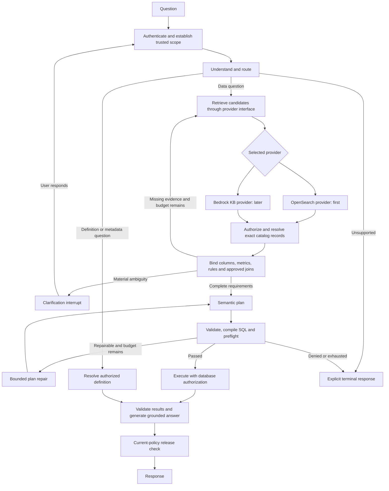

# Text-to-SQL implementation plan: LangGraph with replaceable retrieval

**13 September 2026 | Initial provider: direct Amazon OpenSearch**

## Architecture decision

Use OpenSearch for the first retrieval implementation. Put it behind an application-owned **retrieval-provider interface**, so Bedrock Knowledge Bases or another retrieval backend can be introduced later. Knowledge Bases is a managed retrieval service, not itself a vector database.

Keep exact catalog lookups, authorization, metric definitions, rule applicability, approved relationships and SQL compilation outside the retrieval provider. These are required regardless of how candidates are found.

Start with one Python application organized into modules and a separate ingestion worker. Separate interfaces do not require separate microservices.



The diagram combines several validators for readability. A denial, missing mandatory dependency, stale snapshot or unrecoverable failure must have an explicit terminal path at every relevant stage.

## Step 1. Define the first supported slice and its acceptance cases

Choose one database connection and its actual dialect. Record business timezone/calendar, identity source, data freshness expectations and permitted analytics operations. AWS alone does not identify the SQL dialect.

Certify 10–20 related tables first while allowing the retrieval catalog to contain the larger enterprise schema. Start with lookups, simple aggregates, trends and top-N, plus a few official metrics and approved many-to-one joins. Unsupported analytical operators should produce an explicit response until implemented.

Create 50–100 reviewed development cases initially, with question, expected route, principal, metadata snapshot, approved plan and expected result. Include ambiguity, unauthorized columns, tenant collisions and double-counting counterexamples. Reserve separate validation/test cases grouped by logical question and conversation. These counts are starting suggestions, not a production accuracy guarantee.

**Deliverable:** A supported-capability matrix and versioned evaluation fixtures.

## Step 2. Create the application structure

```text
app/
  api/                         request, resume and result endpoints
  graph/                       state, nodes and conditional routing
  contracts/                   retrieval, catalog and semantic-plan models
  authorization/               current-policy checks and scoped access
  catalog/                     exact metadata access
  semantics/                   metrics, dimensions and rules
  relationships/               approved paths and grain checks
  retrieval/
    service.py                 common retrieval orchestration
    providers/opensearch.py    initial adapter
    providers/bedrock_kb.py    later adapter
  planning/                    intent-to-plan and deterministic binding
  sql/                         compiler, AST checks and database adapters
  results/                     result assertions and answer rendering
  observability/               redacted traces and audit records
ingestion/                     metadata export and provider publication
evaluation/                    fixtures, retrieval and end-to-end evaluations
```

Use Python, LangGraph and validated structured models. Start with PostgreSQL or an existing enterprise metadata service for structured records, S3 for immutable bundles, and managed OpenSearch for search. Reuse existing approved services where available. An approved relationship edge table plus graph algorithms is sufficient initially; a separate graph database is not required.

**Deliverable:** A service skeleton with dependency injection, structured errors and no unrestricted SQL tool exposed to the model.

## Step 3. Define provider-neutral interfaces before OpenSearch code

Use two distinct interfaces:

| Interface | Responsibility |
|---|---|
| `RetrievalProvider.search(request, trusted_scope)` | Ranked discovery of relevant objects/passages. |
| `CatalogService.get_objects/get_columns(...)` | Exact, authorized schema and semantic records at a specified snapshot. |

The retrieval contract should carry:

| Request | Response |
|---|---|
| Search text; object types; optional domain/table IDs; requested candidate budget; catalog snapshot; deadline | Stable object/version/chunk IDs; authorized excerpt; source reference; rank; provider diagnostics; pagination/completion status |

The trusted scope comes from application authorization, never from user-supplied tenant fields or LLM tool arguments. Normalize semantic restrictions rather than passing OpenSearch DSL or Bedrock filter objects through LangGraph.

An illustrative interface—not an existing LangGraph or AWS API—is:

```python
from typing import Protocol

class RetrievalProvider(Protocol):
    async def search(self, request, trusted_scope):
        """Return a validated application SearchResponse."""
        ...

class CatalogService(Protocol):
    async def get_columns(self, table_ids, snapshot_id, trusted_scope):
        """Return an exact authorized column inventory."""
        ...
```

Implement typed request/response models before production. Define errors such as `POLICY_UNREPRESENTABLE`, `SNAPSHOT_NOT_READY`, `PARTIAL_RETRIEVAL`, `TIMEOUT` and `UNSUPPORTED_CAPABILITY`.

Keep ingestion separate: provider publishers submit a bundle, report readiness and retire old releases. Do not pretend bulk indexing and a managed Knowledge Base sync have identical synchronous semantics. Search text, not a precomputed query vector, is the portable input; each adapter owns its embedding behavior.

**Deliverable:** A fake retrieval provider and contract tests that run without OpenSearch.

## Step 4. Implement authorization before model retrieval

Derive tenant, principal, permitted discovery scope and operation permissions from authenticated context. Enforce table, column, metric and row restrictions in their appropriate layers.

Apply policy before retrieval and reranking, again when resolving exact records, before execution and before releasing results. A table grant does not imply every-column access. Compiled SQL may reference restricted fields in joins or filters, so inspect all references, not only output columns.

Require each provider to faithfully enforce the requested discovery scope. If it cannot, fail closed or choose an approved alternative; never silently remove a filter. Database authorization remains a separate enforcement boundary.

**Deliverable:** Negative tests for cross-tenant access, forbidden columns, access revocation and direct retrieval bypass.

## Step 5. Build the authoritative metadata catalog

Extract physical schema from database catalogs and combine it with owner-approved business descriptions. Store stable IDs, source versions/hashes, qualified names, data types, nullability, grain, primary/composite keys, approved values, ownership, security labels and freshness.

For columns, store an explicit parent `table_id`. For relationships, store complete predicates, direction, cardinality, temporal semantics, approval status and prohibited uses. The earlier sample column sidecars need this parent field added before table-scoped column search.

Expose exact methods for table records, authorized column inventories, metric dependencies and relationship records. Use immutable metadata bundles and explicit publication status. Detect drift against the execution database; a pinned old catalog does not freeze live database schema.

**Deliverable:** Every certified table and column resolves by ID, independent of search ranking.

## Step 6. Implement metrics, rules and approved join planning

Version official metrics with expression dependencies, population filters, dimensions, units, time semantics and approved variations. Keep user-defined calculations distinguishable from official KPIs. dbt/MetricFlow integration can be added behind the semantic service; it is not required for the first implementation.

Implement a deterministic rule engine indexed by applicability: global, domain, table, column, metric and table combinations. Security restrictions are non-overridable; conflicting business rules need explicit approved precedence or a failure response. Mandatory rules must not depend on top-K retrieval.

Build join planning over approved relationships. Rank valid alternatives after enforcing semantic roles, temporal meaning, cardinality, permissions and prohibited-path constraints. Prefer the smallest safe table/join set. The shortest graph path alone is insufficient.

When rules or joins introduce dependencies, resolve them until no new requirements appear, with cycle detection and a bounded expansion budget. Do not repair fan-out using indiscriminate `DISTINCT`.

**Deliverable:** Handwritten requests for each official metric deterministically resolve required tables, columns, rules and join predicates.

## Step 7. Define the semantic plan and build a compiler first

The LLM should propose a structured semantic request. The binder resolves its IDs, versions, operator types and dependencies into a validated logical plan. The compiler produces SQL only from supported logical operators.

Example semantic request using the fictional sample catalog:

```json
{
  "operation": "aggregate",
  "metric_ids": ["finance.revenue"],
  "dimension_ids": ["warehouse.commerce.customers.region_name"],
  "time_range": {
    "start": "2026-01-01T00:00:00Z",
    "end_exclusive": "2026-02-01T00:00:00Z",
    "timezone": "UTC"
  },
  "attribution": "current_customer_region"
}
```

The binder adds the approved metric version, date column, population rule and composite join. The model does not supply free-form metric SQL or invented join expressions. Ad hoc calculations use the same typed field/operator validation.

Use an AST library such as SQLGlot for construction, traversal and dialect rendering, with your own binding and policy checks. Parsing alone does not prove database acceptance or business correctness. Parameterize literal values; resolve and quote identifiers through the compiler. [SQLGlot documentation](https://github.com/tobymao/sqlglot)

**Deliverable:** Execute hand-authored semantic plans against controlled fixtures and obtain the expected results before adding the LLM planner.

## Step 8. Export searchable metadata bundles

Produce domain, table, column, glossary, metric, rule and relationship cards with stable IDs and provenance. Use one embedding per concise atomic card. Chunk only longer prose, initially around 512 tokens with modest overlap; evaluate the settings.

Separate source records from search projections. The same reviewed source bundle should support an OpenSearch publisher and, later, a Knowledge Base publisher producing supported source files and metadata sidecars.

For every column card include `object_type`, `object_id`, `table_id`, domain, snapshot, source version and discovery-policy attributes. Never put restricted column descriptions inside a more widely visible table embedding.

Publish complete immutable snapshots, not mutable records pretending to be historical versions. Retain prior snapshots while requests depend on them. A source hash and ingestion manifest allow readiness and provenance checks.

**Deliverable:** Rebuildable search documents with no private content crossing discovery scopes.

## Step 9. Implement the OpenSearch provider

Configure your selected Amazon OpenSearch deployment with a supported vector engine and filtering behavior. Keep deployment-specific mappings, SDK clients and query DSL inside the adapter.

Implement keyword and vector retrieval with identical trusted restrictions. Start with approximately 40 candidates per search path, fuse ranks using an evaluated strategy such as RRF, and optionally rerank. These are starting settings, not guarantees of accuracy. OpenSearch also supports native hybrid search pipelines. [OpenSearch hybrid search](https://docs.opensearch.org/latest/vector-search/ai-search/hybrid-search/index/)

Return application candidate records and diagnostics. Treat timeouts, failed shards and incomplete pages explicitly. Distinguish service-response completion from semantic evidence completeness.

Raw similarity or BM25 scores are provider-specific diagnostics, not universal confidence probabilities. Do not persist assumptions such as “score above 0.8 means correct” in LangGraph.

**Deliverable:** Measured authorized retrieval of expected metric/table/column objects, including restrictive filters and distractor objects.

## Step 10. Build question understanding and routing

Use structured LLM output for question interpretation: requested measure/dimension, filters, temporal intent, comparison/ranking and unresolved meanings. An LLM is useful here because users phrase concepts and conversational references in varied ways. Exact glossary matches and approved defaults should resolve straightforward cases in code.

Route to data query, metadata/definition answer, clarification, unavailable/permission response or unsupported request. A routing model cannot grant permission or decide whether hidden objects exist.

For follow-ups, apply validated changes to a prior semantic request; reauthorize and rebind it. Do not reuse old SQL simply because it executed previously.

**Deliverable:** Correct routes and preserved meaning on the reviewed question set, including requests requiring no SQL.

## Step 11. Implement table and column resolution

Use a metric-first path for official metrics: resolve the metric and its required objects directly, then retrieve descriptions for unresolved dimensions or filters.

For ad hoc questions, retrieve plausible domains/tables, keeping alternatives. Fetch the selected tables' exact authorized column inventories. For wide tables, use RAG scoped by `table_id` to prioritize descriptions while retaining exact dependency access.

The final column set includes user-requested fields plus all metric, rule, time, grouping, ordering and approved-join dependencies. These required columns bypass similarity ranking. Repeat table resolution if a dependency introduces another table.

For the sample Revenue-by-region question, this includes amount, date, status/test/refund fields, current region, the internal-customer flag and both sides of tenant/customer join keys.

Maintain a coverage record for every requested concept: resolved object, authoritative evidence, approved default or unresolved ambiguity. Missing retrieval evidence is not proof that data does not exist.

**Deliverable:** A compact, fully authorized context that covers the question and its mandatory dependencies.

## Step 12. Assemble the LangGraph workflow

Implement the graph nodes as thin calls into tested modules:

| Node | Implementation |
|---|---|
| `authorize_request` | Deterministic policy and identity code |
| `understand_and_route` | Structured LLM output plus deterministic routing checks |
| `retrieve_candidates` | Retrieval service/provider |
| `resolve_context` | Catalog, metric, rule and relationship services |
| `check_coverage` | Deterministic completeness checks; optional semantic ambiguity assessment |
| `clarify` | Targeted question and persistent interrupt |
| `propose_plan` | LLM maps meaning into permitted semantic operators |
| `bind_validate_compile` | Deterministic binding, rules, authorization and SQL compiler |
| `preflight` | Database-specific syntax/planning and resource checks |
| `execute` | Restricted database gateway |
| `validate_results` | Shape, grain, unit and metric-specific assertions |
| `render_and_release` | Deterministic formatting; optional grounded narrative; current-policy check |

Use `StateGraph`, conditional edges and persistence. Nodes can be normal code; every node does not need an LLM. Inject provider/catalog clients through trusted runtime context. For parallel retrieval branches, use distinct state fields or appropriate reducers and an explicit fan-in barrier. [LangGraph graph API](https://docs.langchain.com/oss/python/langgraph/graph-api)

State should contain request/tenant references, original question, resolved intent, catalog/provider profile versions, selected object IDs, requirement coverage, semantic/logical plan, validation reports, query/result references, deadline and retry counters. Keep secrets and live clients out of checkpointed state. Large result sets belong in protected result storage. Checkpoints, caches and streams need access control and explicit redaction. [LangGraph persistence](https://docs.langchain.com/oss/python/langgraph/persistence)

**Deliverable:** One end-to-end vertical slice and every terminal branch work using the same graph with a fake provider and OpenSearch.

## Step 13. Add execution gates and controlled repair

Before execution validate identifiers, reference scopes, metric/rule versions, join contracts, aggregation grain, time boundaries, allowed operators/functions, permissions and resource limits. Inspect all CTEs/subqueries as well as the outer statement. A SELECT can still invoke unsafe functions; read-only syntax is not sufficient authorization.

Use database-specific planning/dry-run facilities where supported. Do not use executing variants such as EXPLAIN ANALYZE as a non-executing safety check. Cost estimates are advisory; enforce runtime timeouts, cancellation, workload limits and output limits. A LIMIT does not generally cap scan work.

Set initial budgets: two retrieval expansions after the initial attempt, two plan repairs total, and at most two retries for classified transient infrastructure errors. Apply a request-wide deadline as well.

Repair typed plans with verified diagnostics, then rebind, recompile and revalidate. Never remove required filters or broaden access to obtain successful execution. Compiler bugs, denied operations and missing approved relationships are not invitations to invent SQL. Check query status after an uncertain execution response before resubmitting.

**Deliverable:** Invalid or unauthorized plans cannot reach execution, and retry loops terminate predictably.

## Step 14. Add clarification, result validation and explainability

Interrupt only for unresolved choices that materially change the answer. An official Revenue definition removes the need to ask what Revenue means when its domain is already established.

Use LangGraph interrupts with a checkpointer and an authenticated conversation/thread binding. Resume through authorization. Interrupted nodes restart when resumed, so avoid non-idempotent actions before the interrupt. [LangGraph interrupts](https://docs.langchain.com/oss/python/langgraph/interrupts)

Validate returned dimensions, grain, units, nulls, duplicates, time coverage and metric-specific ranges. Distinguish a legitimate empty result from missing evidence. Do not silently change filters to make results nonempty. Generic SQL success cannot prove semantic correctness; use reviewed fixtures and contract-specific assertions.

Render numbers directly from verified results. An LLM may explain results when useful, but every numerical claim must be grounded and unsupported causal conclusions excluded. Return applied metric version, filters, time interpretation, data freshness and permitted source references.

Use validation gates and calibrated evaluation signals for answer/clarify/abstain decisions. Do not ask the LLM to invent its own confidence score.

**Deliverable:** Correct values and truthful explanations, with useful clarification and explicit failure responses.

## Step 15. Operationalize and evaluate

Trace object selection, metric/rule versions, join path, plans, validation errors, retries, database query ID, execution duration, result size and provider profile. Protect SQL literals, user questions and result samples under the appropriate audit policy; do not log credentials or unrestricted result data.

Cache by tenant/effective scope, current policy version, catalog snapshot, provider profile and request semantics. A cached object is still subject to current permission checks. Use explicit retention and invalidation.

Evaluate retrieval Recall@K and complete evidence coverage separately from correct plans, results, clarification and authorization violations. Test malicious prompts, poisoned descriptions, stale metadata, join fan-out, timezones, nulls, zero denominators and role changes across follow-ups.

Expand from the certified domain to 300, 1,000 and 5,000+ tables using relevant distractors and cross-domain cases. Add complex analytical operators only with compiler support and counterexample fixtures. Keep answer accuracy and answered coverage visible together.

**Deliverable:** Reviewed release gates and monitoring based on your measured risk/latency requirements, not invented universal accuracy targets.

## Step 16. Verify provider substitution before broad rollout

Implement `BedrockKnowledgeBasesProvider` behind the same contract. Translate authorized restrictions into supported Bedrock filters, send search text through `Retrieve`, and map source metadata back to stable object IDs. Keep exact column/metric/rule resolution in the catalog service. Bedrock exposes hybrid/semantic selection, metadata filters, candidate counts and reranking through its retrieval configuration. [Bedrock Retrieve](https://docs.aws.amazon.com/bedrock/latest/APIReference/API_agent-runtime_Retrieve.html), [retrieval settings](https://docs.aws.amazon.com/bedrock/latest/APIReference/API_agent-runtime_KnowledgeBaseVectorSearchConfiguration.html)

Use a separate Knowledge Base publisher for S3 documents/sidecars and asynchronous ingestion readiness. Do not assume OpenSearch vectors, index mappings, chunk IDs or hybrid scoring can be reused unchanged. Re-embedding/reindexing may be required.

| Must remain stable | May change with provider |
|---|---|
| Canonical object IDs, source provenance, policy semantics, semantic plans, compiler and graph routes | Index/KB handles, embeddings, chunk IDs, ranking settings, query syntax and ingestion jobs |

Run the same authorization, snapshot, completeness, timeout and end-to-end tests against both providers. Equivalent supported behavior is required; identical ranks or raw scores are not. A fake adapter proves dependency injection; only a real second-provider test establishes operational portability.

Shadow-test the second provider with approved data, compare complete evidence and final answers, then switch a validated provider profile and retain rollback. Pin the profile/snapshot mapping per request. A configuration switch is the final deployment action after migration and evaluation, not a substitute for them.

**Deliverable:** Provider substitution without changing business logic or LangGraph nodes, with documented capability differences.

## Recommended milestone order

| Milestone | Scope | Exit evidence |
|---|---|---|
| A. Deterministic foundation | Steps 1–7 | Approved handwritten semantic plans compile and execute correctly under policy. |
| B. OpenSearch retrieval | Steps 8–11 | Required objects and columns are found and resolved under restrictive permissions. |
| C. LangGraph agent | Steps 12–14 | Complete user questions, clarification, repair and failure paths work. |
| D. Production and portability | Steps 15–16 | Evaluated rollout, observability and real second-provider contract tests. |

The plan adds search-provider portability without weakening enterprise truth enforcement. The implementation should treat uncertainty as an explicit outcome; neither retrieval provider can guarantee correct interpretation of every natural-language question.

**Status:** Design and implementation plan only. No application code, cloud infrastructure or live provider migration was deployed by this document.
