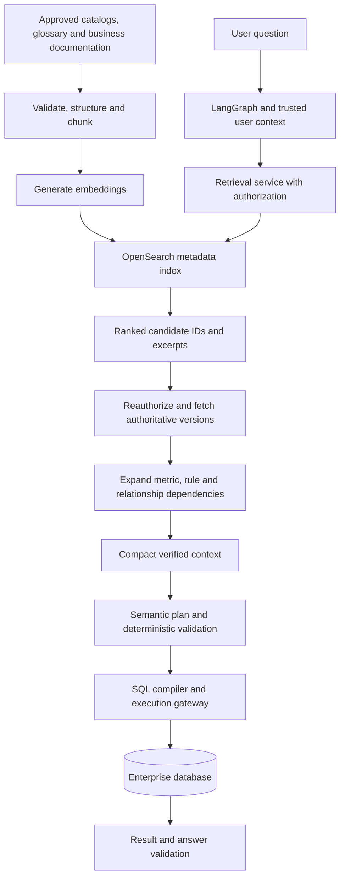

# Using OpenSearch for Enterprise Text-to-SQL RAG

**Technical guide — revised 12 September 2026**

## 1. Purpose and scope

OpenSearch is an open-source search and analytics engine. It stores searchable records in indexes and returns records that match a query. Amazon OpenSearch Service provides AWS-managed deployment options.

This guide uses OpenSearch to find the enterprise knowledge needed to answer natural-language questions about databases: business terms, metrics, table and column descriptions, approved relationships, rules and reviewed examples. OpenSearch supports hybrid retrieval that combines keyword and semantic search. [OpenSearch hybrid search](https://docs.opensearch.org/latest/vector-search/ai-search/hybrid-search/index/)

The application uses **retrieval-augmented generation (RAG)**: it retrieves relevant external knowledge and supplies an authorized selection to a language model. The model interprets the question and proposes a query plan. Deterministic services verify definitions, permissions, relationships and rules before SQL is compiled and executed.

OpenSearch is the discovery index. Authoritative catalogs and registries remain responsible for exact schema facts, metric definitions and executable rules. An embedding similarity score indicates relevance; it does not prove that a metric is correct or a join is permitted.

**Assumptions and limits:** The existing design uses LangGraph and read-only analytics in AWS. The actual OpenSearch deployment/version, AWS Region, embedding model, document languages, permission model, request volume and latency budget have not been provided. Numerical settings below are recommended starting configurations. They have not been benchmarked on the enterprise's data. The configuration examples target a compatible managed OpenSearch domain; Serverless compatibility must be checked separately.

## 2. Architecture and search concepts



An OpenSearch **document** is an indexed JSON record. In this guide, one document represents an atomic metadata card or a passage from a longer source. An **embedding** is a numerical representation generated by a model to support similarity comparisons. A **mapping** defines how fields are indexed. Use `text` fields for searchable prose, `keyword` fields for identifiers and exact filters, and `knn_vector` fields for embeddings.

OpenSearch documents these field types and the default BM25 similarity for text fields. [Text fields](https://docs.opensearch.org/latest/mappings/supported-field-types/text/), [vector fields](https://docs.opensearch.org/latest/mappings/supported-field-types/knn-vector/)

| Search method | How it works | Role in this system |
|---|---|---|
| Exact lookup | Matches a known identifier or canonical value. | Fetch a selected object/version or resolve a known alias. |
| Keyword search | Matches analyzed words; BM25 is the usual default relevance method. | Find exact terminology, acronyms, table names and distinctive phrases. |
| Vector search | Compares numerical embeddings of the question and indexed content. | Retrieve conceptually similar descriptions despite different wording. |
| Hybrid search | Combines lexical and vector rankings. | Cover both precise terminology and paraphrases. |

OpenSearch's native hybrid query uses a search pipeline to combine results. Another implementation is to run two searches and fuse their rankings in the retrieval service. This guide uses the latter for an explicit example; it does not require the native hybrid query or a server-side fusion processor. [OpenSearch hybrid search](https://docs.opensearch.org/latest/vector-search/ai-search/hybrid-search/index/)

Mandatory rules and join completeness require deterministic lookups and graph expansion after retrieval. A top-K similarity search cannot establish that every applicable rule was found. Official metrics use their approved definitions; clearly specified ad hoc calculations can use verified fields and supported operators without becoming official KPIs. dbt and MetricFlow are optional integration choices.

## 3. Prepare the source data

### 3.1 Select authoritative sources

Use database catalogs for physical schema; approved registries for metrics, rules and relationships; and steward-maintained dictionaries for business meaning. Keep source identity, version and approval status.

Create searchable representations for:

* Domain and glossary entries.
* Table cards containing purpose, grain and business roles.
* Column cards containing meaning, type, units and safe value-set references.
* Metric cards containing meaning, population, units, temporal behavior and dependencies.
* Rule and relationship cards containing applicability and business purpose.
* Authorized documentation and reviewed examples.

Avoid bulk indexing transactional rows or sensitive sample values unless the specific use case and access policy require them. A description inferred by an LLM is a draft until the appropriate owner approves it.

### 3.2 Clean and normalize

Remove navigation, repeated headers and extraction artifacts. Preserve headings, units, negations, exclusions, table headers and source locations. Keep qualified identifiers and canonical IDs intact; add aliases as separate fields rather than replacing official names.

Detect duplicate sources and retain version history deliberately. Do not merge similarly named metrics from different domains. Quarantine records with missing provenance, inconsistent versions or unresolved security classification.

### 3.3 Separate searchable text from executable definitions

A metric card helps locate a metric. The complete formula and its dependencies remain in a versioned registry. The same applies to rule conditions and effects, composite keys and temporal join predicates.

For example, a card can explain that Revenue excludes test orders and fully refunded orders. The compiler must fetch the complete approved definition; it must not reconstruct the formula from whichever text fragments were retrieved.

## 4. Chunking strategy

**Recommendation: split by governed object first, and by token count only when needed.** Metadata is structured knowledge, so ordinary document chunking should not be applied uniformly.

### 4.1 Starting configurations

The following sizes are retrieval-card targets, not mandatory lengths or measured optima. Tokens are units used by the selected model/tokenizer, not words or characters.

| Content | Splitting unit | Starting size | Overlap |
|---|---|---:|---:|
| Glossary | One concept and its relevant qualifiers | 100–300 tokens | 0 |
| Table metadata | One table card with purpose, grain and role | 250–600 tokens | 0 |
| Column metadata | One column, or a coherent group with identical access scope | 80–200 tokens per column | 0 |
| Metric metadata | One discovery card per metric version | 250–600 tokens | 0 |
| Rule or relationship | One complete discovery card | 150–400 tokens | 0 |
| Longer explanatory prose | Heading-aware passages | Start at 512 tokens | Start at 64 tokens |

Short records should remain short. Do not pad a 70-token glossary entry or split it merely to meet a target. If a canonical definition is large, create a concise discovery card with a reference to the intact authoritative record.

### 4.2 Splitting method

For longer prose, split at headings, then paragraphs, then sentences. Apply the token budget after these structural boundaries. Carry the document title and section path into the embedding input, accounting for those tokens in the budget.

Use overlap only within a continuous section when it preserves context across boundaries. Do not carry text across unrelated sections, metric versions, tenants or permission boundaries. A 64-token overlap is an approximate target; sentence boundaries may change the actual count.

Keep an explanation with its exceptions where possible. Preserve table headers with row groups. Store approved SQL examples intact as referenced artifacts and index explanatory cards; partial SQL recovered by similarity search is not executable authority.

### 4.3 Why this is suitable

Object cards give precise matches for questions about named tables, fields and metrics. Zero overlap avoids repeatedly retrieving the same atomic definition. Heading-aware prose chunks preserve enough local context to interpret descriptive documentation.

Smaller prose chunks may improve precision for short definitions and reduce irrelevant context. They can also separate a definition from an exception or prerequisite. Larger chunks may preserve explanations and multi-part procedures but dilute relevance and increase context cost. Overlap can recover boundary information while increasing storage, embedding cost and duplicate retrieval.

Tune these tradeoffs by document type and embedding model. An embedding model's maximum input size is a limit, not an optimal chunk size. For example, Amazon Titan Text Embeddings V2 supports up to 8,192 tokens or 50,000 characters, and AWS recommends logical segments for retrieval tasks. [Titan embedding documentation](https://docs.aws.amazon.com/bedrock/latest/userguide/titan-embedding-models.html)

### 4.4 Chunk metadata and expansion

Store stable chunk/document/object IDs, object type, source URI, source version/hash, catalog snapshot, title/section path, source offsets, domain, language, classification, discovery-policy reference, validity dates, publication status, chunker/tokenizer version and embedding configuration. Compute token counts with the appropriate tokenizer when available; document estimates otherwise.

After retrieval, deduplicate and resolve object versions. Fetch the full permitted metric, rule or relationship definition and expand its exact dependencies. For a table hit, fetch relevant columns and required keys rather than automatically loading the whole schema.

Reauthorize every expanded record. Access to a child passage does not imply access to its entire parent. Do not embed restricted column descriptions into a broadly visible table card and expect later field masking to remove their influence.

## 5. Index the prepared records

### 5.1 Select a compatible deployment and embedding configuration

The example uses externally generated, 512-dimensional embeddings and a Lucene HNSW vector index. HNSW is an approximate nearest-neighbor search algorithm. Lucene supports efficient filtered vector search in OpenSearch 2.4 and later; verify support in the actual AWS engine version. This mapping is not a universal Serverless configuration. [Filtered vector search](https://docs.opensearch.org/latest/vector-search/filter-search-knn/index/)

Titan Text Embeddings V2 is one AWS option and supports 512-dimensional output. It is an example, not a model-selection result. Evaluate the model on your terminology and languages. Document and query vectors must use the same model configuration and dimension, with any model-required query/document formatting. [Titan embedding documentation](https://docs.aws.amazon.com/bedrock/latest/userguide/titan-embedding-models.html)

### 5.2 Create an index with explicit mappings

Send the following body to `PUT /enterprise-metadata-v1` through an authenticated, authorized OpenSearch client. The index name is illustrative. Shard/replica sizing and AWS security configuration require environment-specific decisions.

```json
{
  "settings": {"index.knn": true},
  "mappings": {
    "dynamic": "strict",
    "properties": {
      "chunk_id": {"type": "keyword"},
      "document_id": {"type": "keyword"},
      "object_id": {"type": "keyword"},
      "object_type": {"type": "keyword"},
      "tenant_id": {"type": "keyword"},
      "domain": {"type": "keyword"},
      "visibility_group_ids": {"type": "keyword"},
      "snapshot_id": {"type": "keyword"},
      "publication_status": {"type": "keyword"},
      "source_uri": {"type": "keyword"},
      "source_version": {"type": "keyword"},
      "title": {"type": "text", "fields": {"exact": {"type": "keyword"}}},
      "aliases": {"type": "text", "fields": {"exact": {"type": "keyword"}}},
      "content": {"type": "text"},
      "metadata": {"type": "object", "enabled": false},
      "embedding": {
        "type": "knn_vector",
        "dimension": 512,
        "method": {
          "name": "hnsw",
          "engine": "lucene",
          "space_type": "cosinesimil"
        }
      }
    }
  }
}
```

The `metadata` object is retained in `_source` but is not indexed. Every field used for filtering must have an explicit searchable mapping; do not place required policy attributes only inside this unindexed object. Visibility groups are optional inputs to a policy design, not a complete authorization implementation.

### 5.3 Generate embeddings and ingest

Generate embeddings from approved title/section/content text. Validate nonempty input, model limits, vector dimension and finite values; reject invalid vectors instead of substituting zeros. Store the embedding configuration and source hash for reproducibility.

Use document IDs unique to the tenant, catalog snapshot, object version and chunk identity. In a shared index, retain a complete record set for each published snapshot; reusing a source-version-only ID could overwrite a record needed by a pinned request. An alternative is an immutable physical index per snapshot.

For bulk ingestion, inspect every item response: an accepted HTTP request does not establish that every record was indexed. Retry recoverable item failures and quarantine permanent ones. Verify searchable counts and representative lookups after refresh. [OpenSearch Bulk API](https://docs.opensearch.org/latest/api-reference/document-apis/bulk/)

Publish a coherent catalog snapshot only after ingestion and validation succeed. Keep published snapshots immutable and retain them while active requests depend on them. For a new embedding space or incompatible mapping, create a new index and switch the application's read target after testing. Do not mix vectors from different embedding spaces merely because their dimensions match.

## 6. Search and assemble context

### 6.1 Establish scope before searching

Authenticate the caller and derive tenant, purpose and effective discovery permissions in trusted application code. Pin the catalog snapshot. Exact authorized metric/alias lookups can resolve straightforward requests without broad semantic search.

For broader requests, search the relevant object types and domains progressively. Domain routing should retain plausible alternatives; it must not exclude necessary cross-domain dependencies merely because they ranked lower initially.

### 6.2 Run keyword and vector searches

The Python below constructs two OpenSearch search bodies. It assumes `query_vector` came from the selected embedding model and `authorization_filter` came from a trusted policy adapter. Neither is an LLM-authored search instruction. The adapter must return a fail-closed filter, including applicable denies and scope restrictions, and the caller must not be able to bypass it. If the adapter cannot represent or verify the required policy, stop retrieval rather than broadening access.

```python
import math

def search_bodies(question, query_vector, authorization_filter, snapshot_id):
    if len(query_vector) != 512:
        raise ValueError("Embedding dimension does not match the index")
    if not all(math.isfinite(x) for x in query_vector) or not any(query_vector):
        raise ValueError("Cosine search requires a finite, nonzero vector")
    if not authorization_filter:
        raise ValueError("A trusted authorization filter is required")

    scope = {"bool": {"filter": [
        authorization_filter,
        {"term": {"snapshot_id": snapshot_id}},
        {"term": {"publication_status": "approved"}}
    ]}}
    fields = ["chunk_id", "document_id", "object_id", "object_type",
              "title", "content", "source_uri", "source_version", "snapshot_id"]

    keyword_body = {
        "size": 40,
        "_source": fields,
        "query": {"bool": {
            "filter": [scope],
            "must": [{"multi_match": {
                "query": question,
                "fields": ["title^2", "aliases^2", "content"]
            }}]
        }}
    }
    vector_body = {
        "size": 40,
        "_source": fields,
        "query": {"knn": {"embedding": {
            "vector": query_vector,
            "k": 40,
            "filter": scope
        }}}
    }
    return keyword_body, vector_body
```

Send each body to `POST /enterprise-metadata-v1/_search`, or use the equivalent search method of an authenticated client, against the same physical index/snapshot. Run them in parallel where practical. The vector filter is inside the `knn` field configuration. Applying only a final `post_filter` can reduce the number of usable neighbors under restrictive permissions. [OpenSearch k-NN query](https://docs.opensearch.org/latest/query-dsl/specialized/k-nn/index/), [filter behavior](https://docs.opensearch.org/latest/vector-search/filter-search-knn/index/)

The 40-result candidate depth and title/alias boosts of 2 are starting parameters. They are not measured optima. Check timeout and shard-failure indicators before treating a response as complete; classify partial retrieval explicitly. The baseline hybrid path requires both branches to succeed. Any single-branch fallback must be explicit and evaluated separately.

### 6.3 Fuse and optionally rerank

Keyword and vector scores have different meanings. This example uses application-side reciprocal rank fusion (RRF): add `1 / (c + rank)` for each appearance of a record across the two ranked lists, with ranks starting at 1.

```python
def reciprocal_rank_fusion(rankings, c=60):
    scores = {}
    for ranking in rankings:
        seen = set()
        for rank, record_id in enumerate(ranking, start=1):
            if record_id in seen:
                continue
            seen.add(record_id)
            scores[record_id] = scores.get(record_id, 0.0) + 1.0 / (c + rank)
    return sorted(scores, key=lambda key: (-scores[key], key))
```

Use unique versioned chunk IDs within the pinned index. Start with `c=60`, optionally rerank the top 20 candidates, and assemble roughly 10 discovery cards within the context budget. Tune these choices on held-out queries. Deduplicate overlapping passages and avoid allowing many chunks from one source to crowd out required objects.

OpenSearch also documents RRF for its native hybrid pipeline. The application-side implementation above should not be assumed to produce identical rankings to every native distributed configuration. [Reciprocal rank fusion](https://docs.opensearch.org/latest/vector-search/ai-search/hybrid-search/rrf/)

### 6.4 Validate and expand before generation

Recheck current permission and source versions before candidates reach a reranker or LLM. Fetch authoritative definitions and expand required metric, rule and join dependencies. Discovery top-K is not a cap on mandatory dependency closure.

Supply compact verified context to LangGraph's planning nodes. Use approved relationships for join planning and deterministic validation for schema, rules and permissions. If evidence is insufficient, expand retrieval within budget, ask a targeted clarification or return an explicit unavailable response.

For documentation answers, cite the retrieved authoritative sources. For data answers, execute validated SQL and check its results. Retrieved prose alone cannot establish a database value or explain a causal change in a business metric.

## 7. AWS deployment and security

Amazon OpenSearch Service managed domains support index-, document- and field-level security through fine-grained access control. These capabilities are useful when a shared metadata index must enforce different discovery scopes. [AWS fine-grained access control](https://docs.aws.amazon.com/opensearch-service/latest/developerguide/fgac.html)

OpenSearch Serverless is another deployment option. Its documented data-access policies grant collection/index permissions and are additive. Do not assume they provide the same document/field policy model as managed domains. AWS also documents separate Classic and NextGen vector-collection behavior; validate the chosen collection's supported engine and mapping. [Serverless data access](https://docs.aws.amazon.com/opensearch-service/latest/developerguide/serverless-data-access.html), [Serverless vector collections](https://docs.aws.amazon.com/opensearch-service/latest/developerguide/serverless-vector-search.html)

A shared application IAM role does not automatically carry each analyst's enterprise permissions. Restrict search access to trusted services or correctly mapped identities. Construct filters server-side, reauthorize candidates and expanded records, and prevent bypass through direct index access. Keep TLS verification enabled and apply the organization's network, encryption, audit and retention controls.

Treat descriptions and returned text as untrusted content: they cannot change tools, permissions or executable rules. Apply the same access scope to caches, rerankers, examples and parent expansion. Permission revocation must be checked against current policy; index refresh or cached access labels alone are insufficient. Search access does not grant database execution access.

Amazon Bedrock Knowledge Bases is optional. It can manage document-retrieval workflows and supports hybrid search for suitable OpenSearch Serverless configurations containing a filterable text field. This guide uses direct retrieval for precise object/version handling and dependency expansion. A Knowledge Base integration still needs explicit end-user authorization design. [Bedrock retrieval configuration](https://docs.aws.amazon.com/bedrock/latest/userguide/kb-test-config.html)

For a small pilot already using Aurora PostgreSQL, benchmark its supported pgvector option against a separate search deployment. Table count alone does not determine the right service; include indexed object count, update rate, permission selectivity, concurrency and operating cost. [Aurora vector capabilities](https://docs.aws.amazon.com/rds/latest/auroraextendedcontent/aurora-faq-agentic-ai.html)

## 8. Development and evaluation datasets

### 8.1 Make the enterprise corpus the primary dataset

Use a representative corpus of table/column metadata, business terms, metric definitions, rules, relationships and documentation. Pair it with questions and reviewed evidence requirements. Synthetic business definitions are acceptable for initial development if they are explicitly labeled and internally consistent.

Start with approximately 200–300 reviewed scenarios across a coherent schema, then expand from observed failures. Include official metrics, explicit ad hoc calculations, ambiguous terms, missing definitions, multi-hop joins, temporal attribution, unauthorized requests and conversational follow-ups. This starting size does not establish a production accuracy guarantee.

Create multiple principals and at least two tenants with overlapping entity IDs. Include alternative join paths, restricted fields, stale versions and cases where a mandatory rule introduces an unmentioned dependency.

For retrieval-scale tests, keep core questions stable while expanding the catalog to 300, 1,000 and 5,000 objects of the relevant type—specifically tables when testing the stated table-count requirement. Add plausible distractors such as archives, staging tables, snapshots and similarly named domain metrics. A collection of unrelated databases does not reproduce one connected enterprise join graph. Metadata-only tests can use synthetic catalog records; end-to-end executable objects must exist.

### 8.2 Public datasets and their roles

| Dataset | Appropriate use | Additional work required |
|---|---|---|
| BIRD Mini-Dev | SQL baseline, executable databases and schema descriptions. Pin the original 500-question SELECT-only subset and chosen dialect. | Add retrieval relevance labels and enterprise rules/security. Expanded releases also contain other operations; pin the artifact revision and checksum. |
| Spider 2.0-Lite | More complex enterprise-style schema/documentation and SQL evaluation. | Provision the relevant database environment; evaluate table retrieval without supplied oracle table selections. |
| CoSQL | Conversation context and clarification behavior. | Add your metric/version and authorization scenarios. |
| BEIR/SciFact, optional | Small auxiliary check of generic document indexing and ranking. | Scientific abstract retrieval does not validate table selection, SQL joins or enterprise policy. |

BIRD's per-question evidence contains expert-provided hints. Report results with supplied evidence separately from a production-style retrieval setting using only reusable catalog knowledge. Preserve official benchmark protocols when claiming benchmark results. [BIRD Mini-Dev](https://github.com/bird-bench/mini_dev)

Spider 2.0 explicitly distinguishes settings using ground-truth tables; those settings cannot measure your table retriever. CoSQL provides conversational database interactions. BEIR supplies retrieval-evaluation tooling, while SciFact evaluates scientific claim evidence. [Spider 2.0](https://spider2-sql.github.io/), [CoSQL](https://yale-lily.github.io/cosql), [BEIR](https://github.com/beir-cellar/beir), [SciFact](https://aclanthology.org/2020.emnlp-main.609/)

Public SQL scores and your custom enterprise-suite scores should remain separate. Adding a mandatory exclusion or row policy changes the expected answer; regenerate and review that case's gold plan and result.

### 8.3 Minimum useful dataset structure

Keep source documents separate from generated chunks so chunking experiments can rebuild the index without losing provenance.

```text
manifest.json            source revisions, hashes and configuration versions
documents.jsonl         document_id, title, content, source_uri, metadata
chunks.jsonl            chunk_id, document_id, object_id, content, offsets, versions
queries.jsonl           query_id, text, family_id, conversation_id, split
qrels.tsv               scenario_id, evidence_id, relevance_grade
scenarios.jsonl         scenario_id, query_id, principal/scope, policy/snapshot, expected route
gold_plans.jsonl        scenario_id, acceptable plans and complete dependency sets
fixtures/               database fixtures and expected outputs keyed by scenario_id
```

Give each combination of question, principal, policy and snapshot a unique `scenario_id`; one `query_id` can therefore have multiple scenarios with different expected outcomes.

This is a custom format. BEIR uses `_id`, `title`, `text` and its own qrels conventions; use an adapter if using BEIR evaluators. Its standard loader does not preserve arbitrary policy metadata, so retain that information in sidecars or an extended loader. [BEIR data loader](https://github.com/beir-cellar/beir/blob/main/beir/datasets/data_loader.py)

An illustrative source record, before chunking and embedding:

```json
{
  "document_id": "metric-finance-revenue-v7",
  "object_id": "finance.revenue",
  "object_type": "metric",
  "title": "Revenue",
  "content": "Sum approved USD order amounts for completed, non-test orders. Exclude fully refunded orders. Apply the external-customer population rule.",
  "source_uri": "urn:example:approved-metrics:finance.revenue:7",
  "source_version": "7",
  "tenant_id": "tenant-demo",
  "domain": "commerce",
  "snapshot_id": "catalog-demo-42",
  "publication_status": "approved",
  "metadata": {
    "language": "en",
    "section_path": ["Metrics", "Revenue"],
    "discovery_policy_ref": "policy:demo-revenue",
    "canonical_record_ref": "registry:finance.revenue@7"
  }
}
```

All names and definitions in this example are fictional. For indexing, add a generated `chunk_id`, chunk metadata and the real embedding vector. This document illustrates discovery text, not a complete executable metric definition.

Relevance judgments should identify required objects or source evidence spans, not only chunk IDs that change between experiments. Map those judgments to each chunking configuration and review boundary cases. Example grades are `3 = required/direct evidence`, `2 = useful supporting evidence`, `1 = background`, and `0 = judged irrelevant`. Do not automatically label unjudged records irrelevant.

Store acceptable complete dependency sets separately. Flat relevance grades cannot express that either a governed materialized view or a specific multi-table plan is sufficient. Judge the scenario as a whole before constructing its authorized goldset; removing forbidden evidence does not make an incomplete answer correct.

### 8.4 Split without leaking answers

For an initial unsupervised system, a possible split is 60% development, 20% validation and 20% held-out test, grouped before splitting. Development supports chunking/prompt experiments; validation selects among frozen candidates; the test set provides final independent evaluation. If training a reranker or embedding model, allocate a separate training partition. Percentages are starting choices and must leave enough cases in important slices.

Keep paraphrases, complete conversation episodes and variants of one logical case in the same partition. Do not put held-out reference SQL, answers or case-specific hints in retrieved examples.

For new questions on a known enterprise catalog, sharing that catalog across question splits is legitimate. To claim generalization to unseen schemas or sources, hold out complete schemas/parent documents and their child chunks from supervised tuning. For temporal tests, use only metadata and policies available at the scenario's timestamp.

## 9. Evaluate chunking and retrieval

### 9.1 Compare a small, explicit configuration grid

Keep the corpus, embedding model and question splits fixed while changing one factor or a predefined combination. For prose, compare 256, 512 and 768-token targets with 0, 64 and 128-token overlap, omitting combinations above approximately 25% overlap. Treat this as an experiment grid. Tune structured-card granularity separately; do not fragment metric definitions to fit the prose grid.

Compare keyword-only, vector-only and hybrid retrieval, then add reranking if justified. Evaluate candidate depths such as 20, 40 and 80 and final context budgets separately. Measure the actual tokens supplied to the model, including expanded definitions, rather than only the number of retrieved chunks.

### 9.2 Retrieval metrics

Calculate metrics within the scenario's authorized scope and pinned metadata snapshot. Declare the relevance threshold used by binary metrics; for the example grades, a starting convention is grades 2–3 as relevant and grade 1 as background. Evaluate required dependency coverage separately.

| Metric | Meaning and use |
|---|---|
| Recall@K | Fraction of judged relevant evidence found in the top K; report separately for metrics, tables and columns. |
| Precision@K | Relevant results divided by K; report returned counts too, especially when permission filtering yields fewer results. |
| MRR@K | Reciprocal rank of the first relevant result, averaged across questions; useful for single-definition lookup. |
| nDCG@K | Rewards relevant evidence appearing earlier using graded judgments. |
| Complete evidence@K | Whether at least one entire acceptable evidence set is present; useful for multi-object questions. |
| Dependency completeness | Required metric/rule/join dependencies present after deterministic expansion. |
| ANN recall | Overlap with an exact vector-search baseline under the same filter; diagnoses approximate-search loss, not business relevance. |
| Context efficiency | Relevant coverage per context token, duplicate-token rate and unnecessary-object rate. |
| Unauthorized exposure | Forbidden records or fields reaching returned context, rerankers, models, logs or answers. |

For multiple acceptable plans, complete evidence passes when any one approved set is complete. It must not require every alternative path, or accept half of two incompatible paths. Measure direct retrieval and post-expansion coverage separately so graph expansion does not hide a weak initial retriever.

When changing chunk sizes, compare object/source-span coverage and complete meaning, not only chunk-level recall. A large chunk can contain a relevant phrase while wasting most of the context budget. An overlapping chunk may retrieve the same fact twice without adding evidence.

Keep denied and zero-relevant-result cases in a separate explicit evaluation track; ranking tools can otherwise omit them. Review whether apparent retrieval failures are actually missing metadata or incomplete judgments.

### 9.3 End-to-end quality

Evaluate the generated semantic plan and final answer as well as retrieval:

* Correct metric/version, population, dimensions, time interpretation and grain.
* Correct approved relationships and mandatory rule placement.
* Correct values, units, ordering and completeness across database fixtures.
* Appropriate clarification and abstention.
* Grounded explanations and supported numerical claims.
* Authorization enforcement on retrieval, execution, follow-up and release.

Include counterexamples: equal amounts on different orders, duplicate child rows, overlapping categories, missing or overlapping customer-history intervals, nulls, zero denominators, incomplete periods and tenant-key collisions. Successful execution on one fixture is insufficient evidence of semantic correctness.

Record P50/P95 latency, query and indexing cost, embedding/retrieval/reranking time, context tokens and retry rates. Report answer accuracy alongside answered coverage. Select the configuration that meets correctness and security requirements at acceptable latency and cost; no benchmark result is asserted by this guide.

## 10. Operating checklist and validation status

Before rollout:

1. Record the actual AWS deployment, Region, OpenSearch engine/client versions, embedding configuration and supported filter behavior.
2. Verify mappings, identifier preservation, embedding limits and searchable snapshot completeness.
3. Test restrictive permissions in both search branches, parent expansion, caches and direct-access boundaries.
4. Confirm complete metric, rule and join definitions are resolved from authoritative records.
5. Run the chunking/retrieval comparison and inspect failure slices rather than selecting an unexplained default.
6. Keep source versions, index snapshots, chunker versions and retrieval settings in evaluation reports.
7. Define behavior for stale metadata, partial search results, policy outages and insufficient evidence.
8. Require independent checks of SQL semantics and returned answers before expanding production scope.

The JSON examples were parsed, and the Python request builders and fusion function were checked locally using synthetic inputs. These checks verify example structure and local behavior, not server acceptance or retrieval quality. No OpenSearch cluster has been provisioned or queried, and no enterprise retrieval benchmark has been run for this document. Chunk sizes, candidate counts, field boosts and fusion settings remain hypotheses to test against the chosen corpus and embedding model.
